# Risk Aversion Analysis

Set-up analysis using smoking cessation data set.

``` r
data(Smoking)

treats <- c("No intervention", "Self-help", "Individual counselling", "Group counselling")
bcea_smoke <- bcea(eff, cost, ref = 4, interventions = treats, Kmax = 500)
```

Run the risk aversion analysis straight away with both the base R and
ggplot2 versions of plots.

``` r
r <- c(0, 0.005, 0.020, 0.035)
CEriskav(bcea_smoke) <- r

plot(bcea_smoke)
```


``` r
plot(bcea_smoke, graph = "ggplot")
```


Notice that the first value is asymptotically zero but the function
handles that for us. Previously, you had to use something like 1e-10
which was a bit awkward.

Now we modify the comparison group so that it doesn’t contain 2
(“self-help”) anymore. We still keep the same first comparison though
“no intervention”.

``` r
setComparisons(bcea_smoke) <- c(1,3)
```

If we rerun the analysis we should see that the output is exactly the
same.

``` r
CEriskav(bcea_smoke) <- r

plot(bcea_smoke)
```


``` r
plot(bcea_smoke, graph = "ggplot")
```


What happens when we only have one risk adjustment value? Set it to zero
so this should be exactly the same as the baseline `bcea` case.

``` r
r <- 0
CEriskav(bcea_smoke) <- r

plot(bcea_smoke)
```


``` r

plot(bcea_smoke, graph = "ggplot")
```

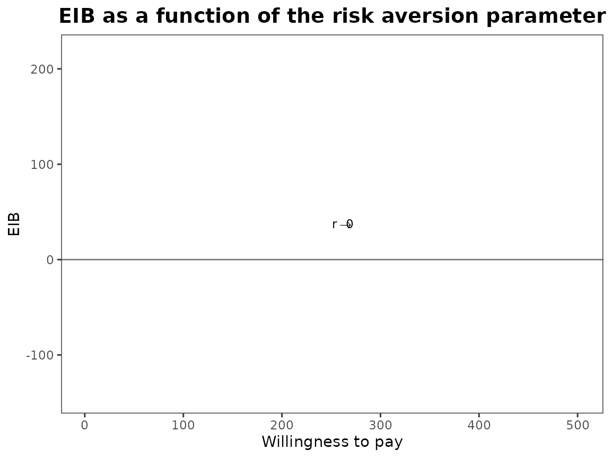

``` r

bcea_smoke0 <- bcea(eff, cost, ref = 4, interventions = treats, Kmax = 500)
eib.plot(bcea_smoke0, comparison = 1)
```


``` r
evi.plot(bcea_smoke0)
```


Check that unusual or meaningless values for `r` are handled gracefully.
At present the are just calculated and plotting exactly the same way.
*should we limit values?*

``` r
# negative
r <- -0.005
CEriskav(bcea_smoke) <- r
plot(bcea_smoke)
```


``` r

# large
r <- 2
CEriskav(bcea_smoke) <- r
plot(bcea_smoke)
```


If we select a new set of comparison interventions what will happen?
There are specified in a different order and for other plots this makes
very little difference (perhaps changing the line types). However, it is
different for
[`CEriskav()`](https://n8thangreen.github.io/BCEA/reference/CEriskav_assign.md)
because only the first comparison intervention is plotted so changing
the order changes the plot. We can see this by swapping “non
intervention” and “individual counselling” interventions from the
analysis above.

``` r
setComparisons(bcea_smoke) <- c(3,1)
```

``` r
r <- c(0, 0.005, 0.020, 0.035)
CEriskav(bcea_smoke) <- r

plot(bcea_smoke)
```


``` r
plot(bcea_smoke, graph = "ggplot")
```

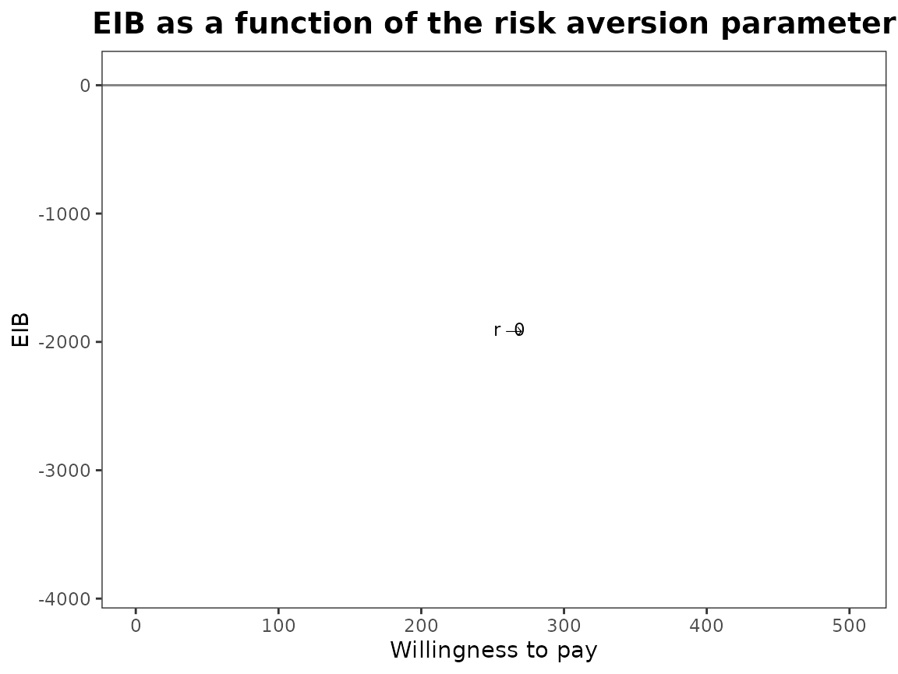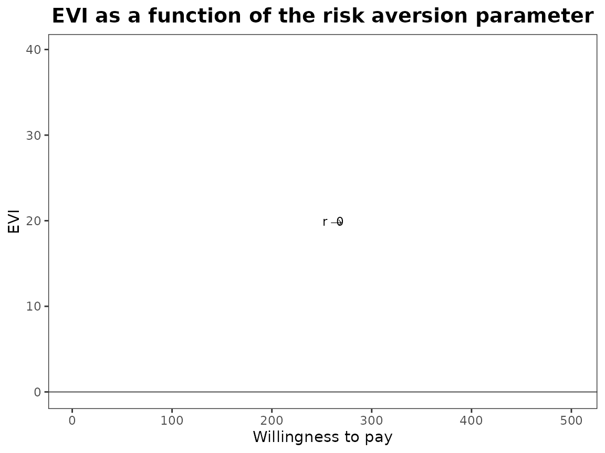

The previous version of
[`CEriskav()`](https://n8thangreen.github.io/BCEA/reference/CEriskav_assign.md)
had a `comparison` argument where you could specify the single
intervention to plot and if this wasn’t set then it defaulted to the
first. It seems neater to separate the definition of the analysis with
the plotting so now if you did want to specify a different comparison
intervention when using
[`CEriskav()`](https://n8thangreen.github.io/BCEA/reference/CEriskav_assign.md)
then you would have to use `setComparison()` first and then call the
plotting function.

Check legend position argument:

``` r
# base R
plot(bcea_smoke, pos = c(1,0))
```


``` r
plot(bcea_smoke, pos = c(1,1))
```


``` r

plot(bcea_smoke, pos = TRUE)
```


``` r
plot(bcea_smoke, pos = FALSE)
```


``` r

plot(bcea_smoke, pos = "topleft")
```


``` r
plot(bcea_smoke, pos = "topright")
```


``` r
plot(bcea_smoke, pos = "bottomleft")
```


``` r
plot(bcea_smoke, pos = "bottomright")
```


``` r

# ggplot2
plot(bcea_smoke, graph = "ggplot", pos = c(1,0))
```


``` r
plot(bcea_smoke, graph = "ggplot", pos = c(1,1))
```

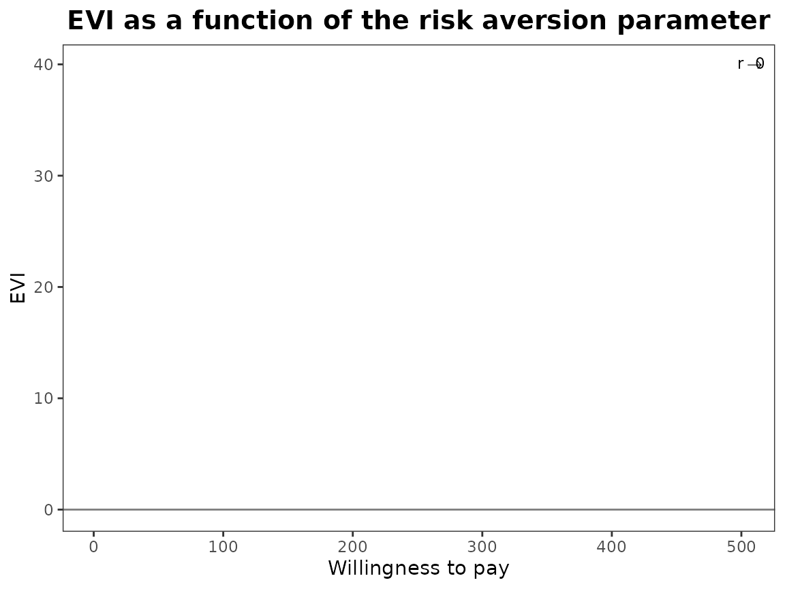

``` r

plot(bcea_smoke, graph = "ggplot", pos = TRUE)
```

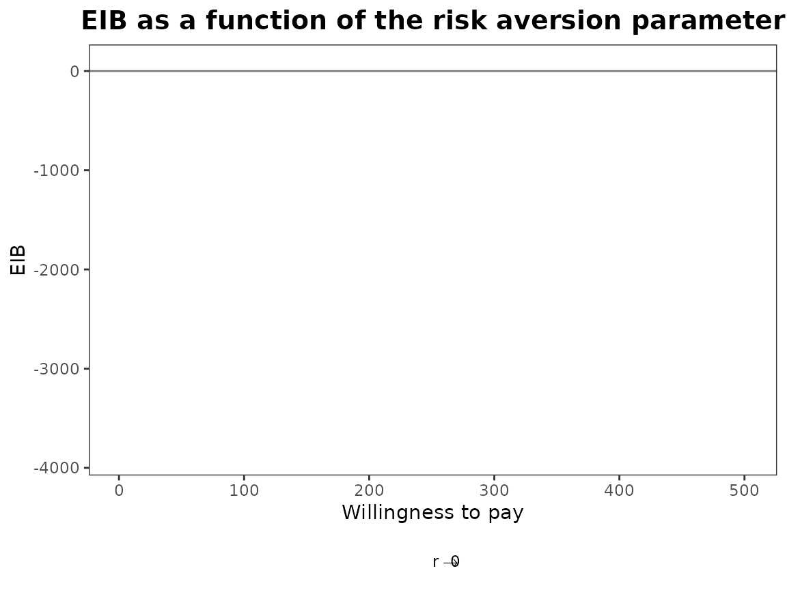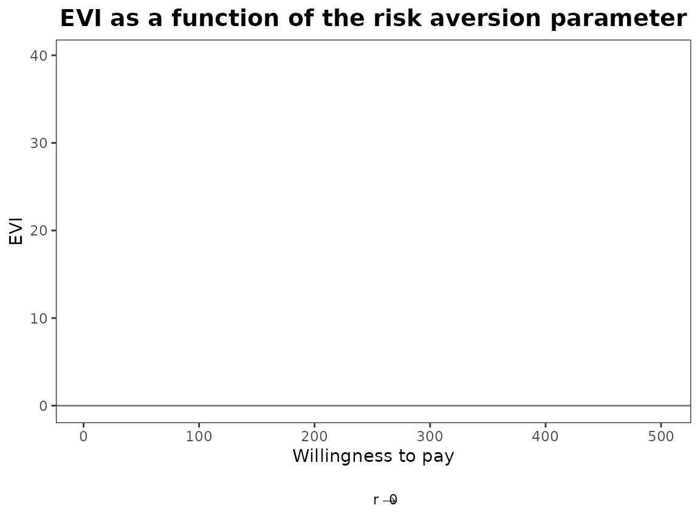

``` r
plot(bcea_smoke, graph = "ggplot", pos = FALSE)
```

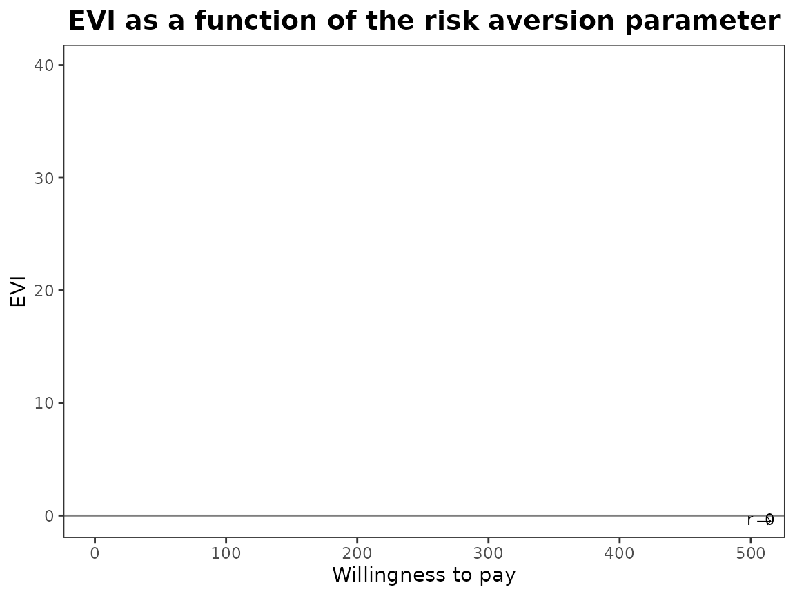

``` r

plot(bcea_smoke, graph = "ggplot", pos = "top")
```

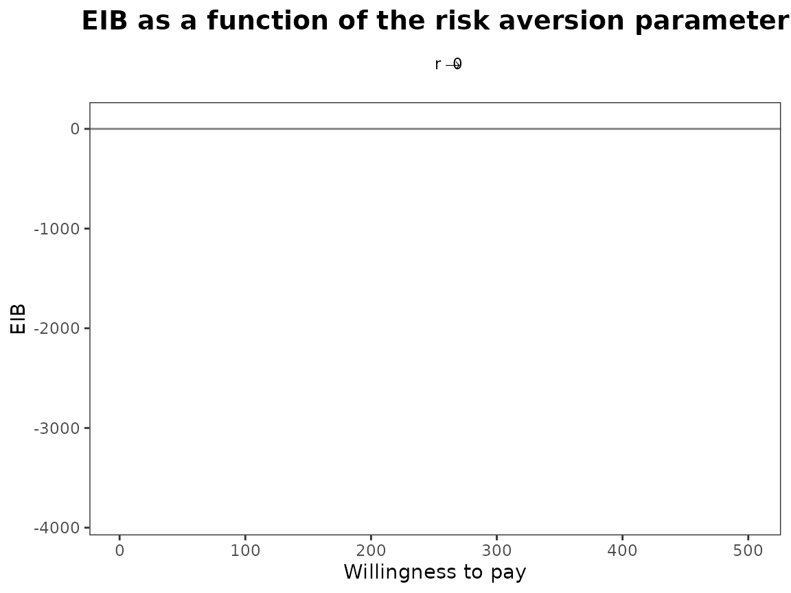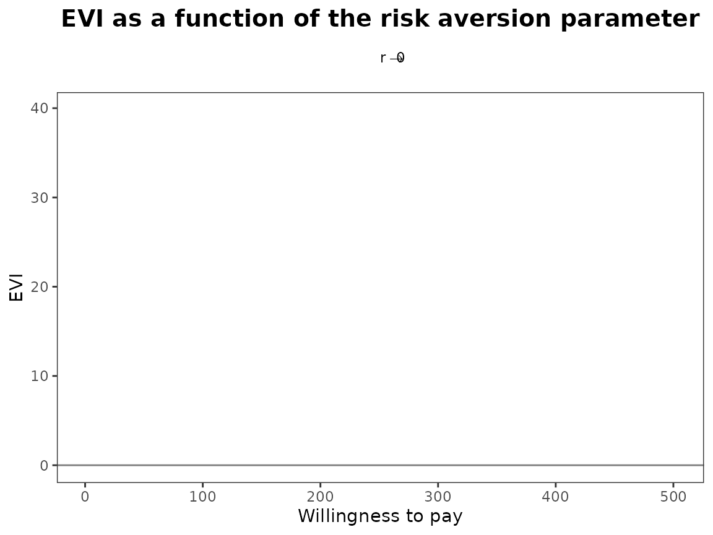

``` r
plot(bcea_smoke, graph = "ggplot", pos = "bottom")
```


``` r
plot(bcea_smoke, graph = "ggplot", pos = "left")
```

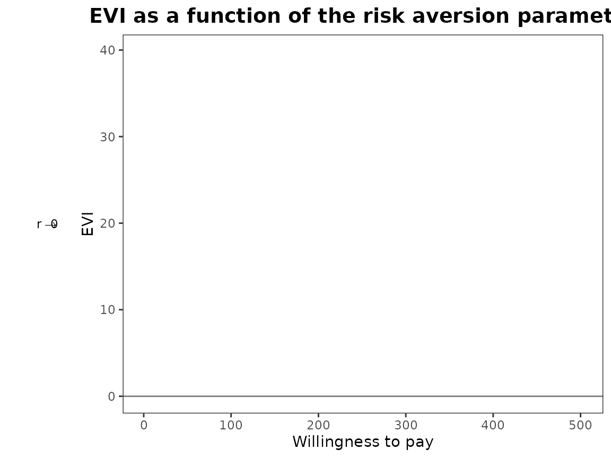

``` r
plot(bcea_smoke, graph = "ggplot", pos = "right")
```

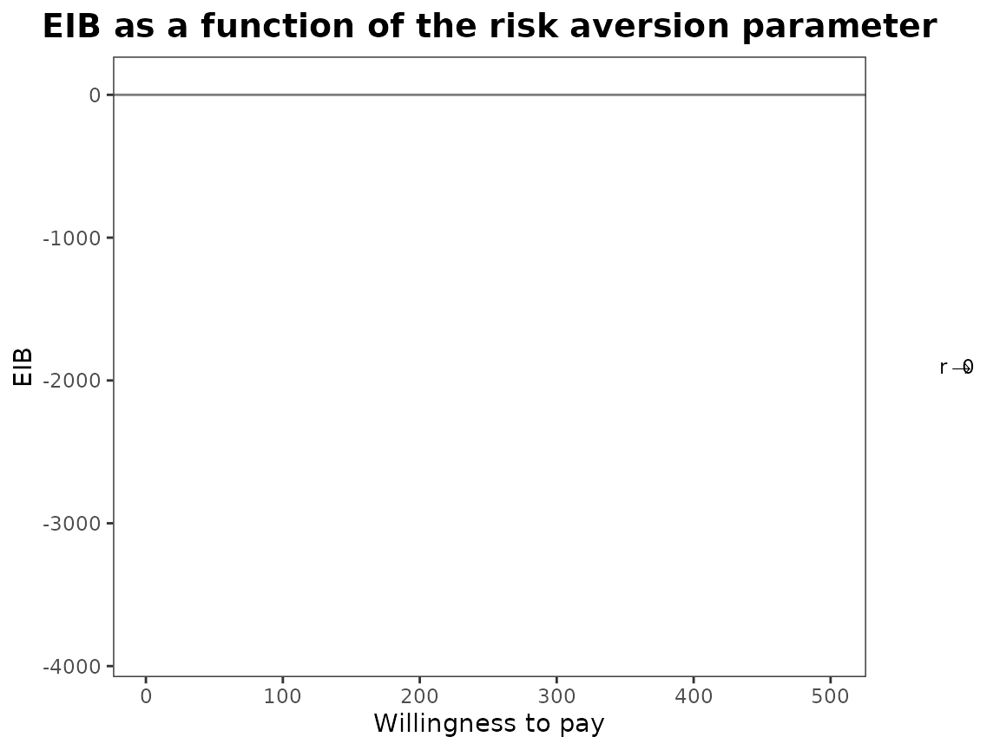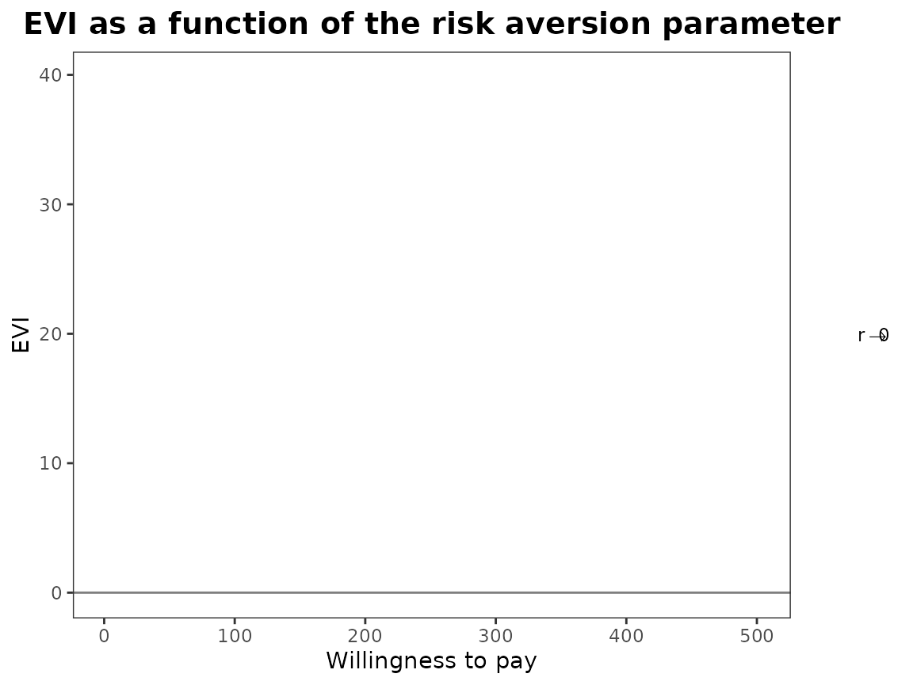
