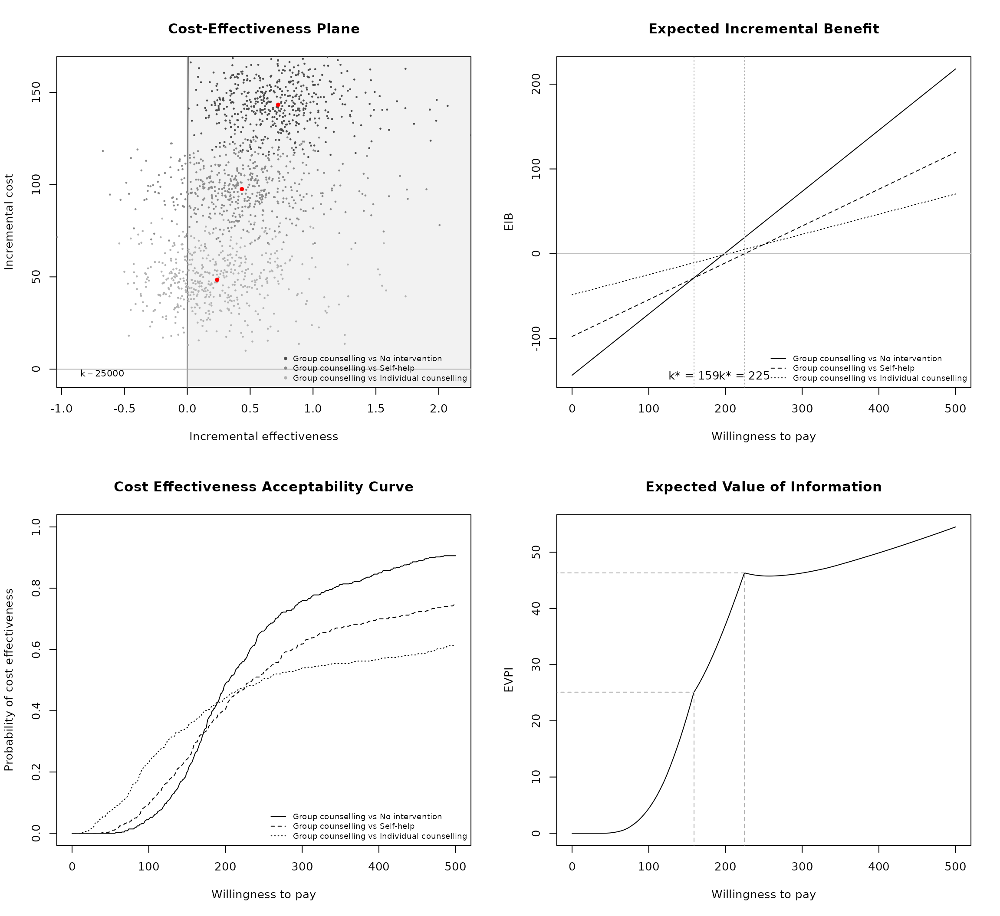
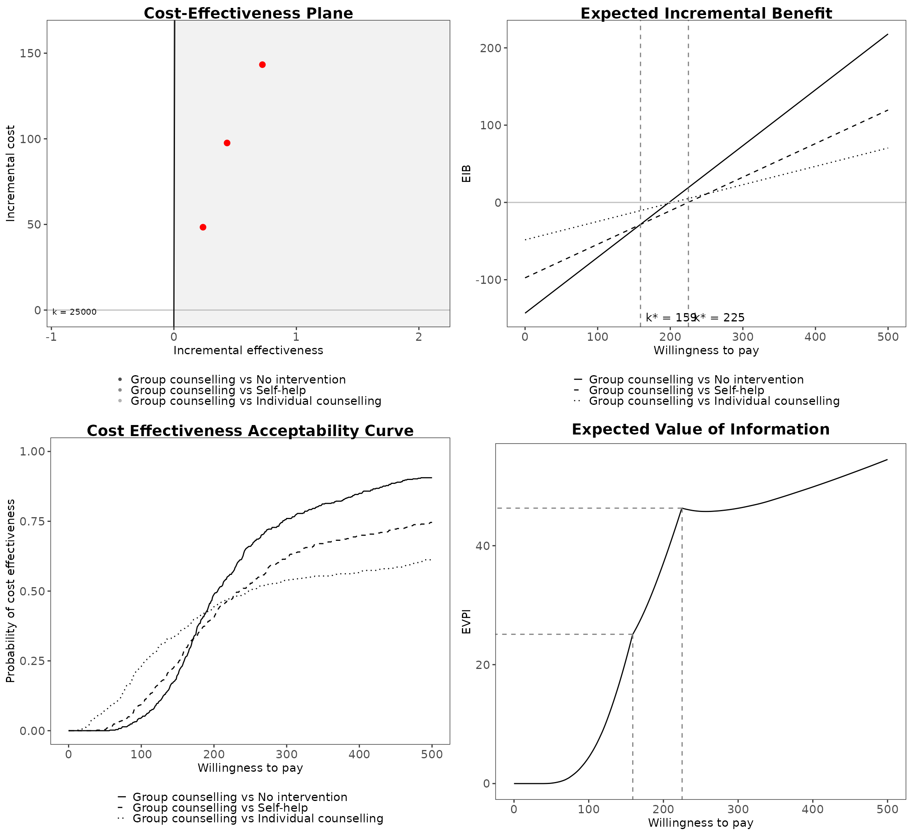
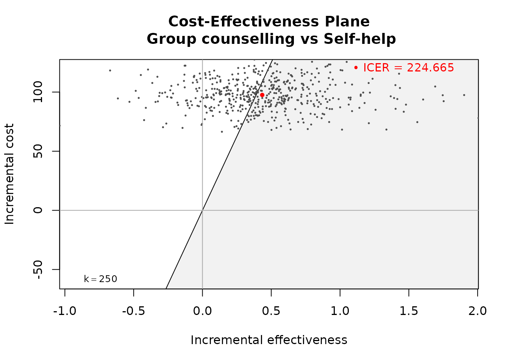
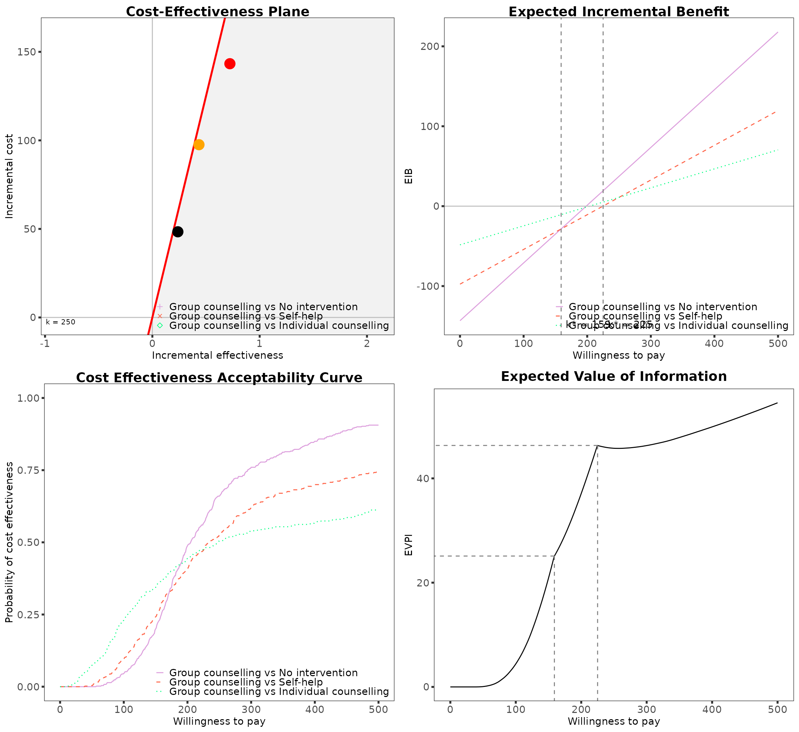

# Getting Started

This vignette will demonstrate a simple cost-effectiveness analysis
using **BCEA** using the smoking cessation data set contained in the
package.

``` r
library(BCEA)
```

Load the data.

``` r
data(Smoking)
```

This study has four interventions.

``` r
treats <- c("No intervention", "Self-help", "Individual counselling", "Group counselling")
```

Setting the reference group (`ref`) to *Group counselling* and the
maximum willingness to pay (`Kmax`) as 500.

``` r
bcea_smoke <- bcea(eff, cost, ref = 4, interventions = treats, Kmax = 500)
```

We can easily create a grid of the most common plots

``` r
library(ggplot2)
library(purrr)

# Default graphical engine is "ggplot2"
plot(bcea_smoke)
```



``` r
# But can be changed by adding the argument "graph"
plot(bcea_smoke, graph = "base")
```


``` r
plot(bcea_smoke, pos = "bottomvertical")
```



``` r
plot(bcea_smoke, graph = "ggplot2", pos = "bottomhorizontal")
```


Individual plots can be plotting using their own functions.

``` r
ceplane.plot(bcea_smoke, comparison = 2, wtp = 250)
```



``` r

eib.plot(bcea_smoke)
```


``` r

contour(bcea_smoke)
```


``` r

ceac.plot(bcea_smoke)
```


``` r

# Can customise like any other ggplot objects
ib.plot(bcea_smoke) + scale_x_continuous(labels=scales::label_dollar(prefix="£"))
#> NB: k (wtp) is defined in the interval [0 - 500]
```


More on this in the other vignettes but you can change the default
plotting style, such as follows.

``` r
plot(bcea_smoke,
     graph = "ggplot2",
     wtp = 250,
     line = list(color = "red", linewidth = 1),
     point = list(color = c("plum", "tomato", "springgreen"), shape = 3:5, size = 2),
     icer = list(color = c("red", "orange", "black"), size = 5))
```


