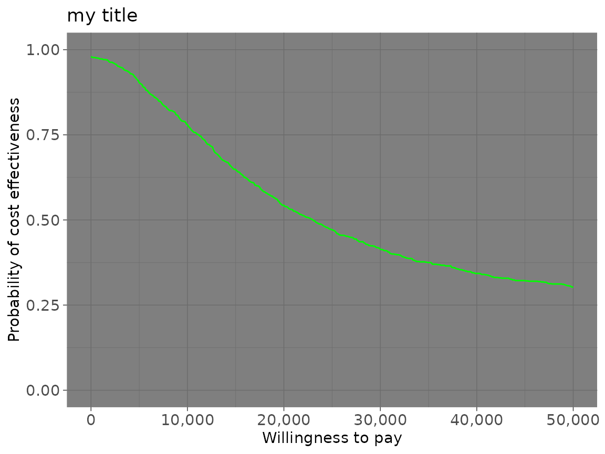
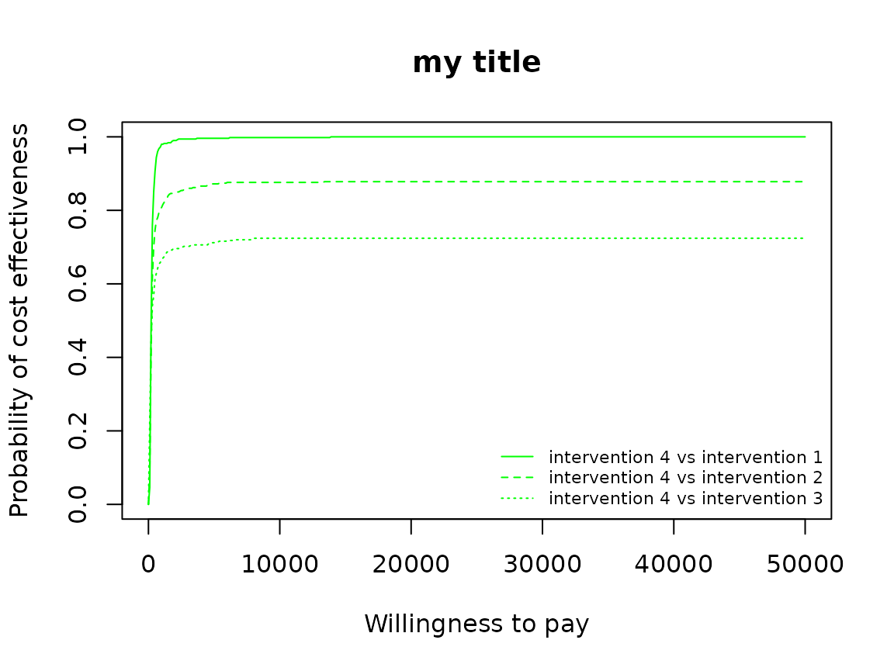
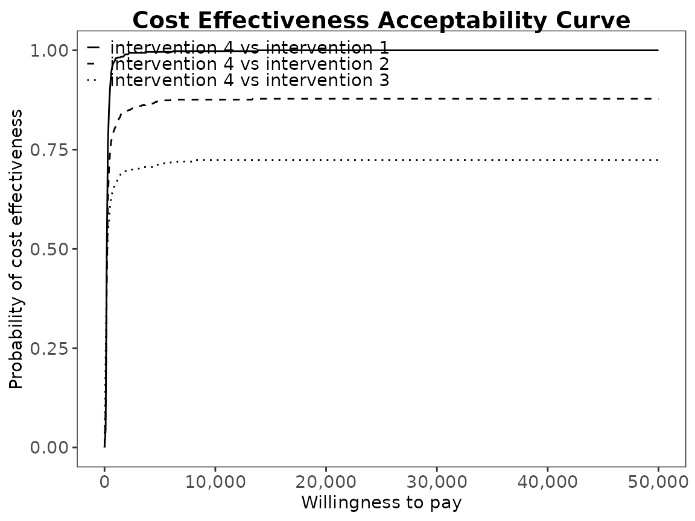
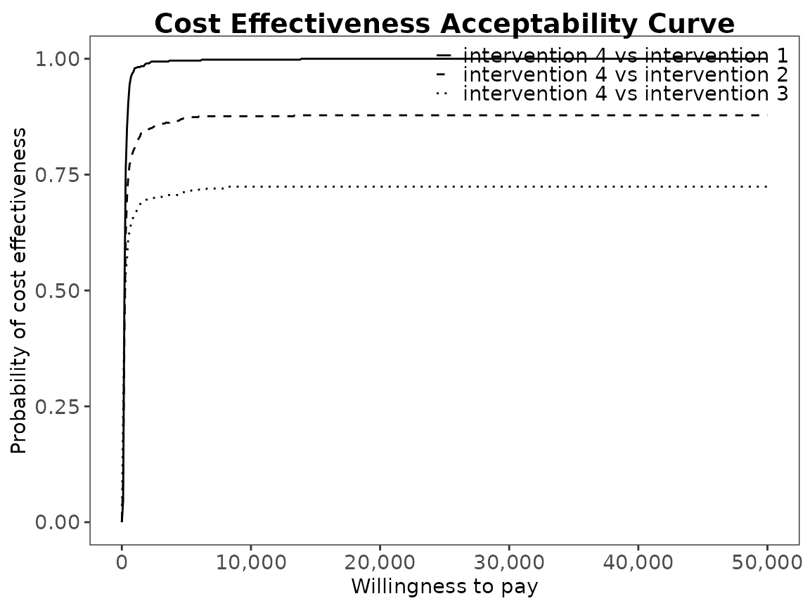
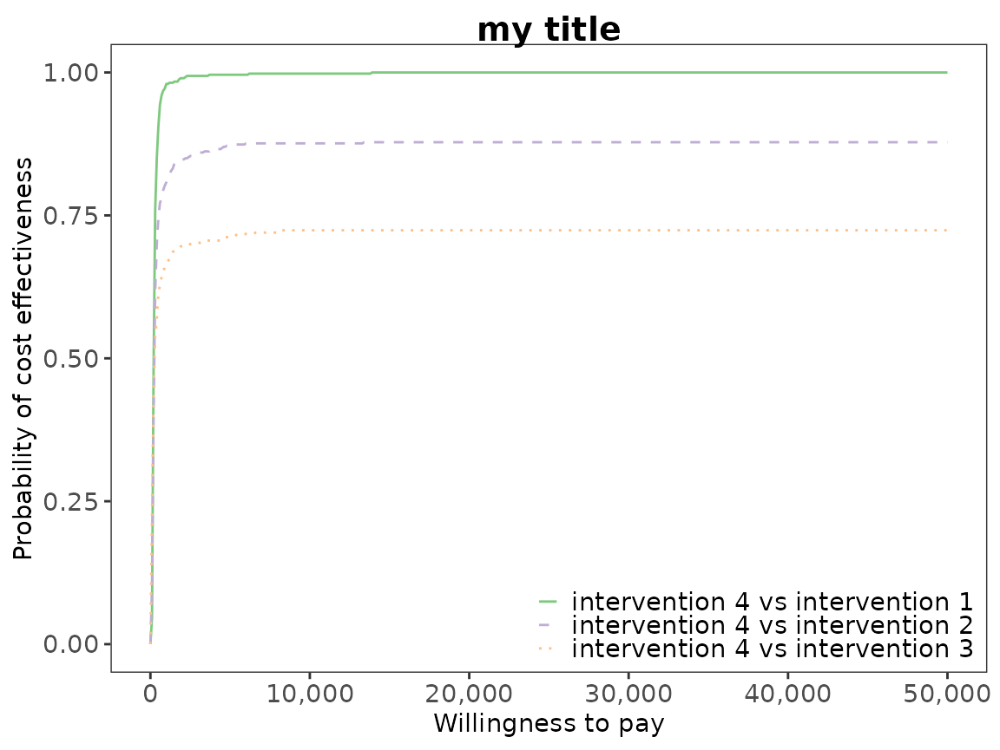

# Cost-Effectiveness Acceptability Curve Plots

## Introduction

The intention of this vignette is to show how to plot different styles
of cost-effectiveness acceptability curves using the BCEA package.

## Two interventions only

This is the simplest case, usually an alternative intervention ($i = 1$)
versus status-quo ($i = 0$).

The plot show the probability that the alternative intervention is
cost-effective for each willingness to pay, $k$,

$$p\left( NB_{1} \geq NB_{0}|k \right){\mspace{6mu}\text{where}\mspace{6mu}}NB_{i} = ke - c$$

Using the set of $N$ posterior samples, this is approximated by

$$\frac{1}{N}\sum\limits_{j}^{N}{\mathbb{I}}\left( k\Delta e^{j} - \Delta c^{j} \right)$$

#### R code

To calculate these in BCEA we use the
[`bcea()`](https://n8thangreen.github.io/BCEA/reference/bcea.md)
function.

``` r
data("Vaccine")

he <- bcea(eff, cost)
#> No reference selected. Defaulting to first intervention.
# str(he)

ceac.plot(he)
```


The plot defaults to base R plotting. Type of plot can be set explicitly
using the `graph` argument.

``` r
ceac.plot(he, graph = "base")
```


``` r
ceac.plot(he, graph = "ggplot2")
```


``` r
# ceac.plot(he, graph = "plotly")
```

Other plotting arguments can be specified such as title, line colours
and theme.

``` r
ceac.plot(he,
          graph = "ggplot2",
          title = "my title",
          line = list(color = "green"),
          theme = theme_dark())
```



## Multiple interventions

This situation is when there are more than two interventions to
consider. Incremental values can be obtained either always against a
fixed reference intervention, such as status-quo, or for all pair-wise
comparisons.

### Against a fixed reference intervention

Without loss of generality, if we assume that we are interested in
intervention $i = 1$, then we wish to calculate

$$p\left( NB_{1} \geq NB_{s}|k \right)\;\;\exists\; s \in S$$

Using the set of $N$ posterior samples, this is approximated by

$$\frac{1}{N}\sum\limits_{j}^{N}{\mathbb{I}}\left( k\Delta e_{1,s}^{j} - \Delta c_{1,s}^{j} \right)$$

#### R code

This is the default plot for
[`ceac.plot()`](https://n8thangreen.github.io/BCEA/reference/ceac.plot.md)
so we simply follow the same steps as above with the new data set.

``` r
data("Smoking")

he <- bcea(eff, cost, ref = 4)
# str(he)
```

Basic plots.

``` r
ceac.plot(he)
```


``` r

ceac.plot(he,
          graph = "base",
          title = "my title",
          line = list(color = "green"))
```



``` r
ceac.plot(he,
          graph = "ggplot2",
          title = "my title",
          line = list(color = "green"))
```


The font size can be adjusted using the `text` argument.

``` r
ceac.plot(he, graph = "ggplot2", text = list(size = 20))
```


``` r
ceac.plot(he, graph = "ggplot2", text = list(size = rel(2)))  # relative scaling, double size
```


``` r

# equivalent but more flexible and direct
ceac.plot(he, graph = "ggplot2") +
  theme(axis.text = element_text(size = 18),
        axis.title.x = element_text(size = 20),
        axis.title.y = element_text(size = 20))
```


We can reposition the legend.

``` r
ceac.plot(he, pos = FALSE) # bottom right
```


``` r
ceac.plot(he, pos = c(0, 0))
```


``` r
ceac.plot(he, pos = c(0, 1))
```


``` r
ceac.plot(he, pos = c(1, 0))
```


``` r
ceac.plot(he, pos = c(1, 1))
```


``` r
ceac.plot(he, graph = "ggplot2", pos = c(0, 0))
```


``` r
ceac.plot(he, graph = "ggplot2", pos = c(0, 1))
```



``` r
ceac.plot(he, graph = "ggplot2", pos = c(1, 0))
```


``` r
ceac.plot(he, graph = "ggplot2", pos = c(1, 1))
```



Define colour palette.

``` r
mypalette <- RColorBrewer::brewer.pal(3, "Accent")

ceac.plot(he,
          graph = "base",
          title = "my title",
          line = list(color = mypalette),
          pos = FALSE)
```


``` r

ceac.plot(he,
          graph = "ggplot2",
          title = "my title",
          line = list(color = mypalette),
          pos = FALSE)
```



### Pair-wise comparisons

Again, without loss of generality, if we assume that we are interested
in intervention $i = 1$, then we wish to calculate

$$p\left( NB_{1} = \max\{ NB_{i}:i \in S\}|k \right)$$

This can be approximated by the following.

$$\frac{1}{N}\sum\limits_{j}^{N}\prod\limits_{i \in S}{\mathbb{I}}\left( k\Delta e_{1,i}^{j} - \Delta c_{1,i}^{j} \right)$$

#### R code

In BCEA we first we must determine all combinations of paired
interventions using the
[`multi.ce()`](https://n8thangreen.github.io/BCEA/reference/multi.ce.md)
function.

``` r
he <- multi.ce(he)
```

We can use the same plotting calls as before
i.e. [`ceac.plot()`](https://n8thangreen.github.io/BCEA/reference/ceac.plot.md)
and BCEA will deal with the pairwise situation appropriately. Note that
in this case the probabilities at a given willingness to pay sum to 1.

``` r
ceac.plot(he, graph = "base")
```


``` r

ceac.plot(he,
          graph = "base",
          title = "my title",
          line = list(color = "green"),
          pos = FALSE)
```


``` r

mypalette <- RColorBrewer::brewer.pal(4, "Dark2")

ceac.plot(he,
          graph = "base",
          title = "my title",
          line = list(color = mypalette),
          pos = c(0,1))
```


``` r
ceac.plot(he,
          graph = "ggplot2",
          title = "my title",
          line = list(color = mypalette),
          pos = c(0,1))
```


The line width can be changes with either a single value to change all
lines to the same thickness or a value for each.

``` r
ceac.plot(he,
          graph = "ggplot2",
          title = "my title",
          line = list(size = 2))
```


``` r
ceac.plot(he,
          graph = "ggplot2",
          title = "my title",
          line = list(size = c(1,2,3)))
```


