# Cost-Effectiveness Efficiency Frontier

## Introduction

The line connecting successive points on a cost-effectiveness plane
which each represent the effect and cost associated with different
treatment alternatives. The gradient of a line segment represents the
ICER of the treatment comparison between the two alternatives
represented by that segment. The cost-effectiveness frontier consists of
the set of points corresponding to treatment alternatives that are
considered to be cost-effective at different values of the
cost-effectiveness threshold. The steeper the gradient between
successive points on the frontier, the higher is the ICER between these
treatment alternatives and the more expensive alternative would be
considered cost-effective only when a high value of the
cost-effectiveness threshold is assumed. Points not lying on the
cost-effectiveness frontier represent treatment alternatives that are
not considered cost-effective at any value of the cost-effectiveness
threshold.

## R code

To create the plots in BCEA we first call the
[`bcea()`](https://n8thangreen.github.io/BCEA/reference/bcea.md)
function.

``` r
data(Smoking)

treats <- c("No intervention", "Self-help", "Individual counselling", "Group counselling")
bcea_smoke <- bcea(eff, cost, ref = 4, interventions = treats, Kmax = 500)
```

- base R

``` r
# all interventions
ceef.plot(bcea_smoke)
#> 
#> Cost-effectiveness efficiency frontier summary 
#> 
#> Interventions on the efficiency frontier:
#>                   Effectiveness   Costs Increase slope Increase angle
#> Self-help               0.28824  45.733         158.66         1.5645
#> Group counselling       0.72252 143.301         224.67         1.5663
#> 
#> Interventions not on the efficiency frontier:
#>                        Effectiveness  Costs     Dominance type
#> No intervention              0.00000  0.000 Extended dominance
#> Individual counselling       0.48486 94.919 Extended dominance
```


``` r

# subset
setComparisons(bcea_smoke) <- c(1,3)
ceef.plot(bcea_smoke)
#> 
#> Cost-effectiveness efficiency frontier summary 
#> 
#> Interventions on the efficiency frontier:
#>                        Effectiveness   Costs Increase slope Increase angle
#> Self-help                    0.48486  94.919         195.77         1.5657
#> Individual counselling       0.72252 143.301         203.57         1.5659
#> 
#> Interventions not on the efficiency frontier:
#>                 Effectiveness Costs     Dominance type
#> No intervention             0     0 Extended dominance
```


``` r

# check numbering and legend
setComparisons(bcea_smoke) <- c(3,1)
ceef.plot(bcea_smoke)
#> 
#> Cost-effectiveness efficiency frontier summary 
#> 
#> Interventions on the efficiency frontier:
#>                        Effectiveness   Costs Increase slope Increase angle
#> Self-help                    0.48486  94.919         195.77         1.5657
#> Individual counselling       0.72252 143.301         203.57         1.5659
#> 
#> Interventions not on the efficiency frontier:
#>                 Effectiveness Costs     Dominance type
#> No intervention             0     0 Extended dominance
```

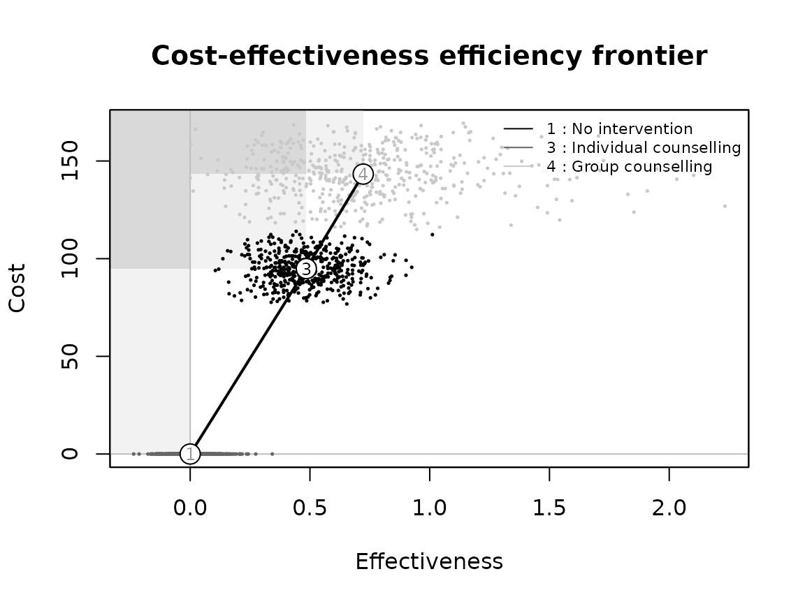

``` r

setComparisons(bcea_smoke) <- c(3,2)
ceef.plot(bcea_smoke)
#> 
#> Cost-effectiveness efficiency frontier summary 
#> 
#> Interventions on the efficiency frontier:
#>                        Effectiveness  Costs Increase slope Increase angle
#> Individual counselling       0.43428 97.568         224.67         1.5663
#> 
#> Interventions not on the efficiency frontier:
#>                 Effectiveness Costs     Dominance type
#> No intervention             0     0 Extended dominance
#> Self-help                   0     0 Extended dominance
```

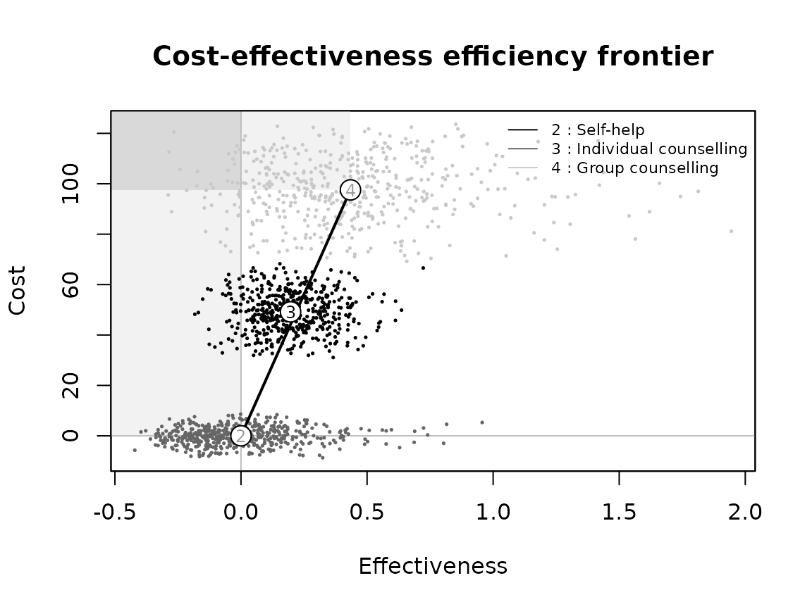

``` r

setComparisons(bcea_smoke) <- 1
ceef.plot(bcea_smoke)
#> 
#> Cost-effectiveness efficiency frontier summary 
#> 
#> Interventions on the efficiency frontier:
#>           Effectiveness Costs Increase slope Increase angle
#> Self-help       0.72252 143.3         198.33         1.5658
#> 
#> Interventions not on the efficiency frontier:
#>                 Effectiveness Costs     Dominance type
#> No intervention             0     0 Extended dominance
```

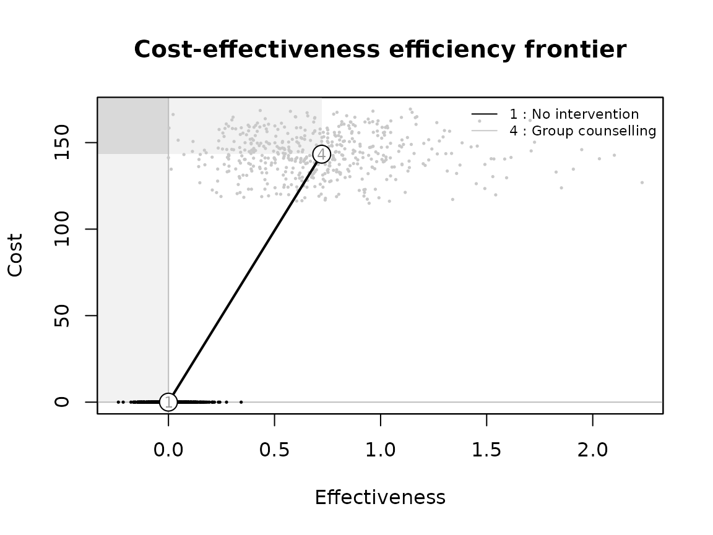

``` r

# add interventions back in
setComparisons(bcea_smoke) <- c(1,3)
ceef.plot(bcea_smoke)
#> 
#> Cost-effectiveness efficiency frontier summary 
#> 
#> Interventions on the efficiency frontier:
#>                        Effectiveness   Costs Increase slope Increase angle
#> Self-help                    0.48486  94.919         195.77         1.5657
#> Individual counselling       0.72252 143.301         203.57         1.5659
#> 
#> Interventions not on the efficiency frontier:
#>                 Effectiveness Costs     Dominance type
#> No intervention             0     0 Extended dominance
```


- ggplot

``` r
bcea_smoke <- bcea(eff, cost, ref = 4, interventions = treats, Kmax = 500)

# all interventions
ceef.plot(bcea_smoke, graph = "ggplot")
#> 
#> Cost-effectiveness efficiency frontier summary 
#> 
#> Interventions on the efficiency frontier:
#>                   Effectiveness   Costs Increase slope Increase angle
#> Self-help               0.28824  45.733         158.66         1.5645
#> Group counselling       0.72252 143.301         224.67         1.5663
#> 
#> Interventions not on the efficiency frontier:
#>                        Effectiveness  Costs     Dominance type
#> No intervention              0.00000  0.000 Extended dominance
#> Individual counselling       0.48486 94.919 Extended dominance
```


``` r

# subset
setComparisons(bcea_smoke) <- c(1,3)
ceef.plot(bcea_smoke, graph = "ggplot")
#> 
#> Cost-effectiveness efficiency frontier summary 
#> 
#> Interventions on the efficiency frontier:
#>                        Effectiveness   Costs Increase slope Increase angle
#> Self-help                    0.48486  94.919         195.77         1.5657
#> Individual counselling       0.72252 143.301         203.57         1.5659
#> 
#> Interventions not on the efficiency frontier:
#>                 Effectiveness Costs     Dominance type
#> No intervention             0     0 Extended dominance
```

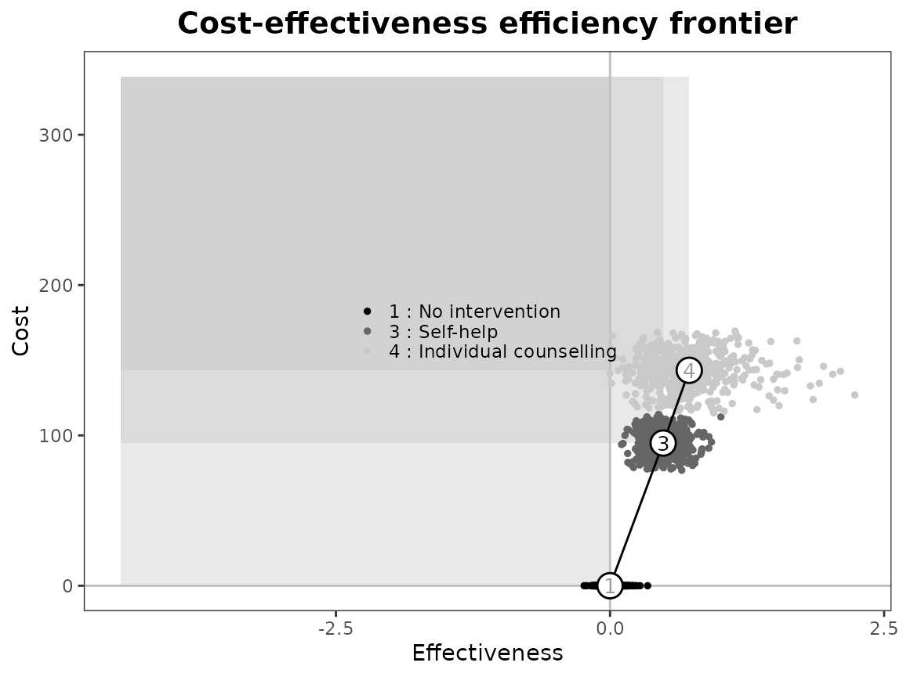

``` r

# check numbering and legend
setComparisons(bcea_smoke) <- c(3,1)
ceef.plot(bcea_smoke, graph = "ggplot")
#> 
#> Cost-effectiveness efficiency frontier summary 
#> 
#> Interventions on the efficiency frontier:
#>                        Effectiveness   Costs Increase slope Increase angle
#> Self-help                    0.48486  94.919         195.77         1.5657
#> Individual counselling       0.72252 143.301         203.57         1.5659
#> 
#> Interventions not on the efficiency frontier:
#>                 Effectiveness Costs     Dominance type
#> No intervention             0     0 Extended dominance
```


``` r

setComparisons(bcea_smoke) <- c(3,2)
ceef.plot(bcea_smoke, graph = "ggplot")
#> 
#> Cost-effectiveness efficiency frontier summary 
#> 
#> Interventions on the efficiency frontier:
#>                        Effectiveness  Costs Increase slope Increase angle
#> Individual counselling       0.43428 97.568         224.67         1.5663
#> 
#> Interventions not on the efficiency frontier:
#>                 Effectiveness Costs     Dominance type
#> No intervention             0     0 Extended dominance
#> Self-help                   0     0 Extended dominance
```


``` r

setComparisons(bcea_smoke) <- 1
ceef.plot(bcea_smoke, graph = "ggplot")
#> 
#> Cost-effectiveness efficiency frontier summary 
#> 
#> Interventions on the efficiency frontier:
#>           Effectiveness Costs Increase slope Increase angle
#> Self-help       0.72252 143.3         198.33         1.5658
#> 
#> Interventions not on the efficiency frontier:
#>                 Effectiveness Costs     Dominance type
#> No intervention             0     0 Extended dominance
```

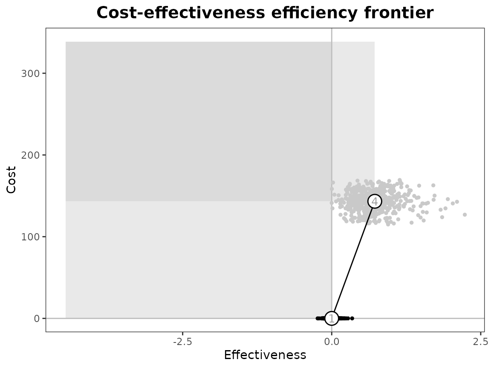

``` r

# add interventions back in
setComparisons(bcea_smoke) <- c(1,3)
ceef.plot(bcea_smoke, graph = "ggplot")
#> 
#> Cost-effectiveness efficiency frontier summary 
#> 
#> Interventions on the efficiency frontier:
#>                        Effectiveness   Costs Increase slope Increase angle
#> Self-help                    0.48486  94.919         195.77         1.5657
#> Individual counselling       0.72252 143.301         203.57         1.5659
#> 
#> Interventions not on the efficiency frontier:
#>                 Effectiveness Costs     Dominance type
#> No intervention             0     0 Extended dominance
```


Check legend position argument:

``` r
# base R
ceef.plot(bcea_smoke, pos = c(1,0))
#> 
#> Cost-effectiveness efficiency frontier summary 
#> 
#> Interventions on the efficiency frontier:
#>                        Effectiveness   Costs Increase slope Increase angle
#> Self-help                    0.48486  94.919         195.77         1.5657
#> Individual counselling       0.72252 143.301         203.57         1.5659
#> 
#> Interventions not on the efficiency frontier:
#>                 Effectiveness Costs     Dominance type
#> No intervention             0     0 Extended dominance
```


``` r
ceef.plot(bcea_smoke, pos = c(1,1))
#> 
#> Cost-effectiveness efficiency frontier summary 
#> 
#> Interventions on the efficiency frontier:
#>                        Effectiveness   Costs Increase slope Increase angle
#> Self-help                    0.48486  94.919         195.77         1.5657
#> Individual counselling       0.72252 143.301         203.57         1.5659
#> 
#> Interventions not on the efficiency frontier:
#>                 Effectiveness Costs     Dominance type
#> No intervention             0     0 Extended dominance
```


``` r

ceef.plot(bcea_smoke, pos = TRUE)
#> 
#> Cost-effectiveness efficiency frontier summary 
#> 
#> Interventions on the efficiency frontier:
#>                        Effectiveness   Costs Increase slope Increase angle
#> Self-help                    0.48486  94.919         195.77         1.5657
#> Individual counselling       0.72252 143.301         203.57         1.5659
#> 
#> Interventions not on the efficiency frontier:
#>                 Effectiveness Costs     Dominance type
#> No intervention             0     0 Extended dominance
```


``` r
ceef.plot(bcea_smoke, pos = FALSE)
#> 
#> Cost-effectiveness efficiency frontier summary 
#> 
#> Interventions on the efficiency frontier:
#>                        Effectiveness   Costs Increase slope Increase angle
#> Self-help                    0.48486  94.919         195.77         1.5657
#> Individual counselling       0.72252 143.301         203.57         1.5659
#> 
#> Interventions not on the efficiency frontier:
#>                 Effectiveness Costs     Dominance type
#> No intervention             0     0 Extended dominance
```


``` r

ceef.plot(bcea_smoke, pos = "topleft")
#> 
#> Cost-effectiveness efficiency frontier summary 
#> 
#> Interventions on the efficiency frontier:
#>                        Effectiveness   Costs Increase slope Increase angle
#> Self-help                    0.48486  94.919         195.77         1.5657
#> Individual counselling       0.72252 143.301         203.57         1.5659
#> 
#> Interventions not on the efficiency frontier:
#>                 Effectiveness Costs     Dominance type
#> No intervention             0     0 Extended dominance
```

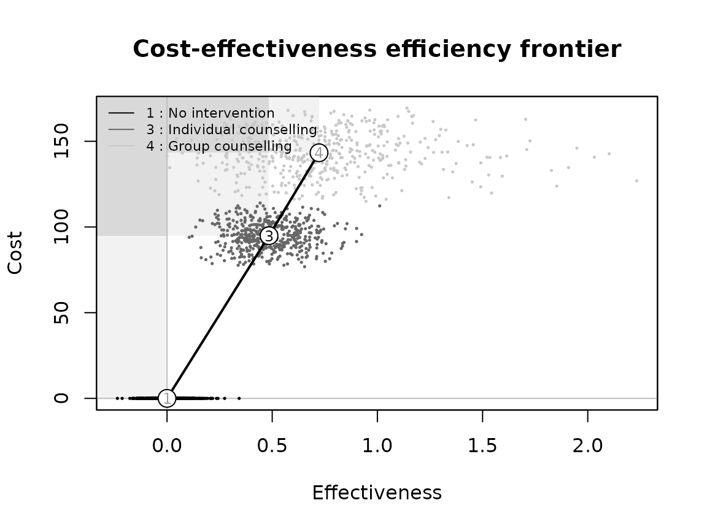

``` r
ceef.plot(bcea_smoke, pos = "topright")
#> 
#> Cost-effectiveness efficiency frontier summary 
#> 
#> Interventions on the efficiency frontier:
#>                        Effectiveness   Costs Increase slope Increase angle
#> Self-help                    0.48486  94.919         195.77         1.5657
#> Individual counselling       0.72252 143.301         203.57         1.5659
#> 
#> Interventions not on the efficiency frontier:
#>                 Effectiveness Costs     Dominance type
#> No intervention             0     0 Extended dominance
```


``` r
ceef.plot(bcea_smoke, pos = "bottomleft")
#> 
#> Cost-effectiveness efficiency frontier summary 
#> 
#> Interventions on the efficiency frontier:
#>                        Effectiveness   Costs Increase slope Increase angle
#> Self-help                    0.48486  94.919         195.77         1.5657
#> Individual counselling       0.72252 143.301         203.57         1.5659
#> 
#> Interventions not on the efficiency frontier:
#>                 Effectiveness Costs     Dominance type
#> No intervention             0     0 Extended dominance
```


``` r
ceef.plot(bcea_smoke, pos = "bottomright")
#> 
#> Cost-effectiveness efficiency frontier summary 
#> 
#> Interventions on the efficiency frontier:
#>                        Effectiveness   Costs Increase slope Increase angle
#> Self-help                    0.48486  94.919         195.77         1.5657
#> Individual counselling       0.72252 143.301         203.57         1.5659
#> 
#> Interventions not on the efficiency frontier:
#>                 Effectiveness Costs     Dominance type
#> No intervention             0     0 Extended dominance
```


``` r

# ggplot2
ceef.plot(bcea_smoke, graph = "ggplot", pos = c(1,0))
#> 
#> Cost-effectiveness efficiency frontier summary 
#> 
#> Interventions on the efficiency frontier:
#>                        Effectiveness   Costs Increase slope Increase angle
#> Self-help                    0.48486  94.919         195.77         1.5657
#> Individual counselling       0.72252 143.301         203.57         1.5659
#> 
#> Interventions not on the efficiency frontier:
#>                 Effectiveness Costs     Dominance type
#> No intervention             0     0 Extended dominance
```

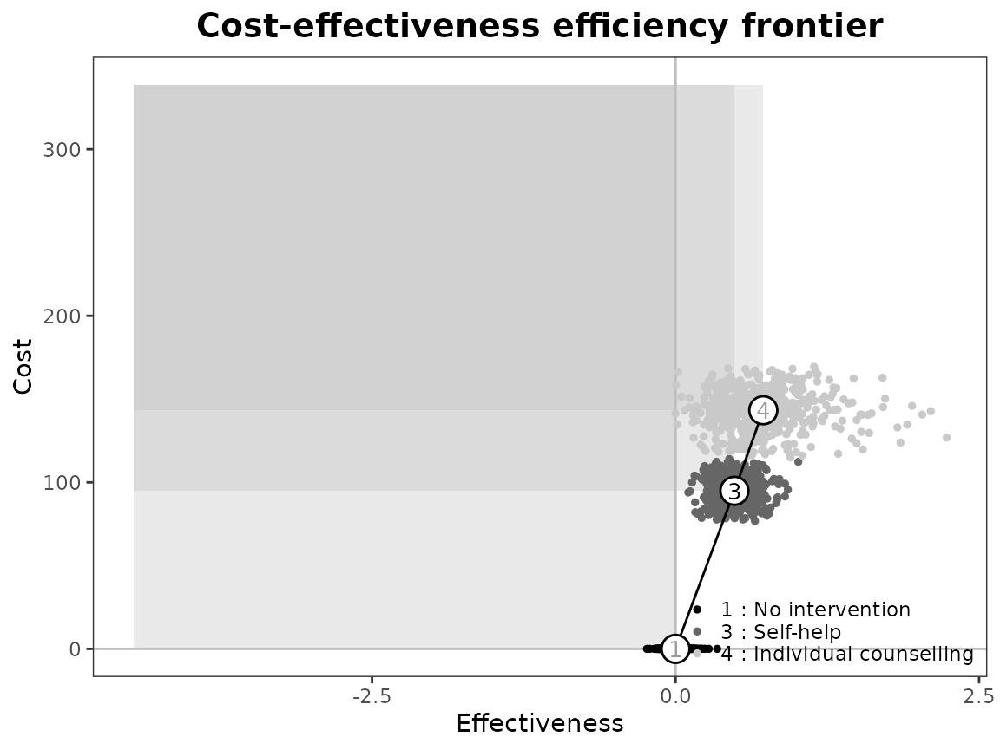

``` r
ceef.plot(bcea_smoke, graph = "ggplot", pos = c(1,1))
#> 
#> Cost-effectiveness efficiency frontier summary 
#> 
#> Interventions on the efficiency frontier:
#>                        Effectiveness   Costs Increase slope Increase angle
#> Self-help                    0.48486  94.919         195.77         1.5657
#> Individual counselling       0.72252 143.301         203.57         1.5659
#> 
#> Interventions not on the efficiency frontier:
#>                 Effectiveness Costs     Dominance type
#> No intervention             0     0 Extended dominance
```


``` r

ceef.plot(bcea_smoke, graph = "ggplot", pos = TRUE)
#> 
#> Cost-effectiveness efficiency frontier summary 
#> 
#> Interventions on the efficiency frontier:
#>                        Effectiveness   Costs Increase slope Increase angle
#> Self-help                    0.48486  94.919         195.77         1.5657
#> Individual counselling       0.72252 143.301         203.57         1.5659
#> 
#> Interventions not on the efficiency frontier:
#>                 Effectiveness Costs     Dominance type
#> No intervention             0     0 Extended dominance
```


``` r
ceef.plot(bcea_smoke, graph = "ggplot", pos = FALSE)
#> 
#> Cost-effectiveness efficiency frontier summary 
#> 
#> Interventions on the efficiency frontier:
#>                        Effectiveness   Costs Increase slope Increase angle
#> Self-help                    0.48486  94.919         195.77         1.5657
#> Individual counselling       0.72252 143.301         203.57         1.5659
#> 
#> Interventions not on the efficiency frontier:
#>                 Effectiveness Costs     Dominance type
#> No intervention             0     0 Extended dominance
```


``` r

ceef.plot(bcea_smoke, graph = "ggplot", pos = "top")
#> 
#> Cost-effectiveness efficiency frontier summary 
#> 
#> Interventions on the efficiency frontier:
#>                        Effectiveness   Costs Increase slope Increase angle
#> Self-help                    0.48486  94.919         195.77         1.5657
#> Individual counselling       0.72252 143.301         203.57         1.5659
#> 
#> Interventions not on the efficiency frontier:
#>                 Effectiveness Costs     Dominance type
#> No intervention             0     0 Extended dominance
```


``` r
ceef.plot(bcea_smoke, graph = "ggplot", pos = "bottom")
#> 
#> Cost-effectiveness efficiency frontier summary 
#> 
#> Interventions on the efficiency frontier:
#>                        Effectiveness   Costs Increase slope Increase angle
#> Self-help                    0.48486  94.919         195.77         1.5657
#> Individual counselling       0.72252 143.301         203.57         1.5659
#> 
#> Interventions not on the efficiency frontier:
#>                 Effectiveness Costs     Dominance type
#> No intervention             0     0 Extended dominance
```


``` r
ceef.plot(bcea_smoke, graph = "ggplot", pos = "left")
#> 
#> Cost-effectiveness efficiency frontier summary 
#> 
#> Interventions on the efficiency frontier:
#>                        Effectiveness   Costs Increase slope Increase angle
#> Self-help                    0.48486  94.919         195.77         1.5657
#> Individual counselling       0.72252 143.301         203.57         1.5659
#> 
#> Interventions not on the efficiency frontier:
#>                 Effectiveness Costs     Dominance type
#> No intervention             0     0 Extended dominance
```


``` r
ceef.plot(bcea_smoke, graph = "ggplot", pos = "right")
#> 
#> Cost-effectiveness efficiency frontier summary 
#> 
#> Interventions on the efficiency frontier:
#>                        Effectiveness   Costs Increase slope Increase angle
#> Self-help                    0.48486  94.919         195.77         1.5657
#> Individual counselling       0.72252 143.301         203.57         1.5659
#> 
#> Interventions not on the efficiency frontier:
#>                 Effectiveness Costs     Dominance type
#> No intervention             0     0 Extended dominance
```

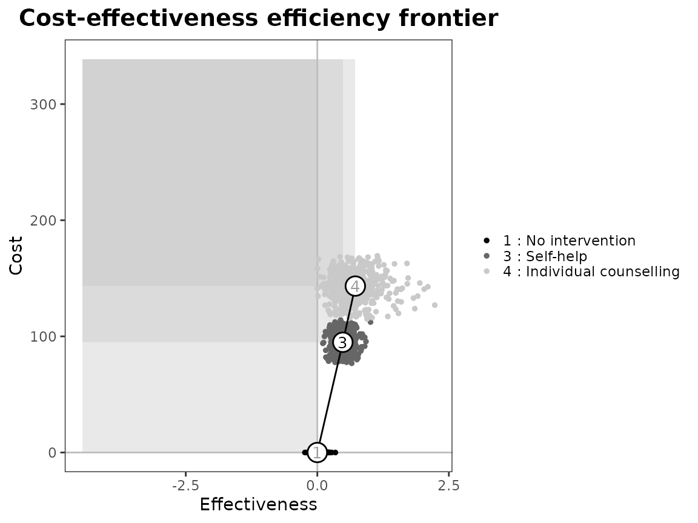

### Flipping plot

``` r
ceef.plot(bcea_smoke,
          flip = TRUE,
          dominance = FALSE,
          start.from.origins = FALSE,
          print.summary = FALSE,
          graph = "base")
```

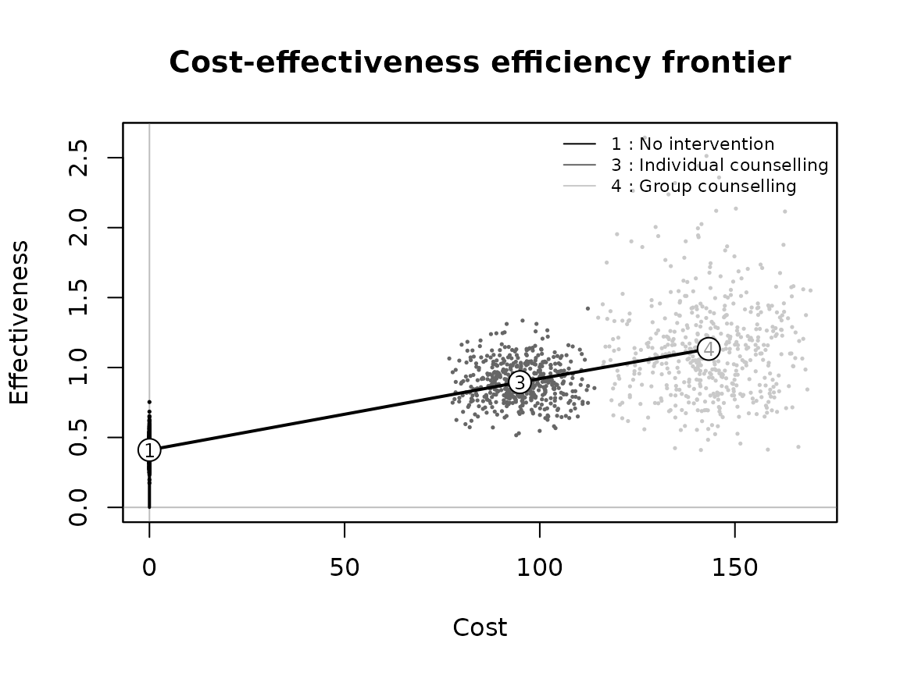

``` r

ceef.plot(bcea_smoke,
          dominance = TRUE,
          start.from.origins = FALSE,
          pos = TRUE,
          print.summary = FALSE,
          graph = "ggplot2")
```


### Start from origin or smallest (e,c).

``` r
ceef.plot(bcea_smoke,
          flip = TRUE,
          dominance = TRUE,
          start.from.origins = TRUE,
          print.summary = FALSE,
          graph = "base")
```


``` r

ceef.plot(bcea_smoke,
          dominance = TRUE,
          start.from.origins = TRUE,
          pos = TRUE,
          print.summary = FALSE,
          graph = "ggplot2")
```


### Negative cost or effectiveness

``` r
data("Smoking")

cost[, 4] <- -cost[, 4]
bcea_smoke <- bcea(eff, cost, ref = 3, interventions = treats, Kmax = 500)

# all interventions
ceef.plot(bcea_smoke, graph = "ggplot")
#> Costs are negative, the frontier will not start from the origins
#> 
#> Cost-effectiveness efficiency frontier summary 
#> 
#> Interventions on the efficiency frontier:
#>                   Effectiveness  Costs Increase slope Increase angle
#> Group counselling         1.133 -143.3             NA             NA
#> 
#> Interventions not on the efficiency frontier:
#>                        Effectiveness  Costs     Dominance type
#> No treatment                 0.41051  0.000 Absolute dominance
#> Self-help                    0.69875 45.733 Absolute dominance
#> Individual counselling       0.89536 94.919 Absolute dominance
```


``` r
ceef.plot(bcea_smoke, graph = "base")
#> Costs are negative, the frontier will not start from the origins
#> 
#> Cost-effectiveness efficiency frontier summary 
#> 
#> Interventions on the efficiency frontier:
#>                   Effectiveness  Costs Increase slope Increase angle
#> Group counselling         1.133 -143.3             NA             NA
#> 
#> Interventions not on the efficiency frontier:
#>                        Effectiveness  Costs     Dominance type
#> No treatment                 0.41051  0.000 Absolute dominance
#> Self-help                    0.69875 45.733 Absolute dominance
#> Individual counselling       0.89536 94.919 Absolute dominance
```


``` r

ceef.plot(bcea_smoke, start.from.origins = TRUE, graph = "ggplot")
#> Costs are negative, the frontier will not start from the origins
#> 
#> Cost-effectiveness efficiency frontier summary 
#> 
#> Interventions on the efficiency frontier:
#>                   Effectiveness  Costs Increase slope Increase angle
#> Group counselling         1.133 -143.3             NA             NA
#> 
#> Interventions not on the efficiency frontier:
#>                        Effectiveness  Costs     Dominance type
#> No treatment                 0.41051  0.000 Absolute dominance
#> Self-help                    0.69875 45.733 Absolute dominance
#> Individual counselling       0.89536 94.919 Absolute dominance
```


``` r
ceef.plot(bcea_smoke, start.from.origins = TRUE, graph = "base")
#> Costs are negative, the frontier will not start from the origins
#> 
#> Cost-effectiveness efficiency frontier summary 
#> 
#> Interventions on the efficiency frontier:
#>                   Effectiveness  Costs Increase slope Increase angle
#> Group counselling         1.133 -143.3             NA             NA
#> 
#> Interventions not on the efficiency frontier:
#>                        Effectiveness  Costs     Dominance type
#> No treatment                 0.41051  0.000 Absolute dominance
#> Self-help                    0.69875 45.733 Absolute dominance
#> Individual counselling       0.89536 94.919 Absolute dominance
```


``` r

setComparisons(bcea_smoke) <- c(1,2)
ceef.plot(bcea_smoke, graph = "ggplot")
#> 
#> Cost-effectiveness efficiency frontier summary 
#> 
#> Interventions on the efficiency frontier:
#>                        Effectiveness  Costs Increase slope Increase angle
#> Self-help                    0.28824 45.733         158.66         1.5645
#> Individual counselling       0.48486 94.919         250.16         1.5668
#> 
#> Interventions not on the efficiency frontier:
#>              Effectiveness Costs     Dominance type
#> No treatment             0     0 Extended dominance
```


``` r
ceef.plot(bcea_smoke, graph = "base")
#> 
#> Cost-effectiveness efficiency frontier summary 
#> 
#> Interventions on the efficiency frontier:
#>                        Effectiveness  Costs Increase slope Increase angle
#> Self-help                    0.28824 45.733         158.66         1.5645
#> Individual counselling       0.48486 94.919         250.16         1.5668
#> 
#> Interventions not on the efficiency frontier:
#>              Effectiveness Costs     Dominance type
#> No treatment             0     0 Extended dominance
```

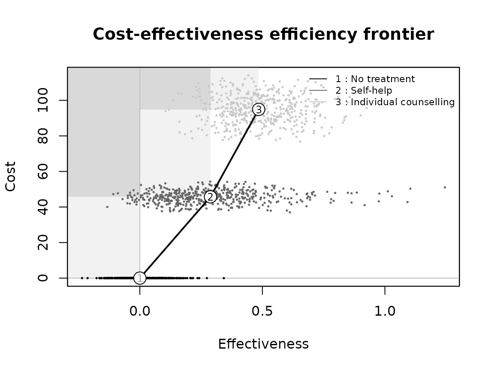

``` r

eff[, 3] <- -eff[, 3]
bcea_smoke <- bcea(eff, cost, ref = 3, interventions = treats, Kmax = 500)
ceef.plot(bcea_smoke, graph = "ggplot")
#> Costs and benefits are negative, the frontier will not start from the origins
#> 
#> Cost-effectiveness efficiency frontier summary 
#> 
#> Interventions on the efficiency frontier:
#>                   Effectiveness  Costs Increase slope Increase angle
#> Group counselling         1.133 -143.3             NA             NA
#> 
#> Interventions not on the efficiency frontier:
#>                        Effectiveness  Costs     Dominance type
#> No treatment                 0.41051  0.000 Absolute dominance
#> Self-help                    0.69875 45.733 Absolute dominance
#> Individual counselling      -0.89536 94.919 Absolute dominance
```

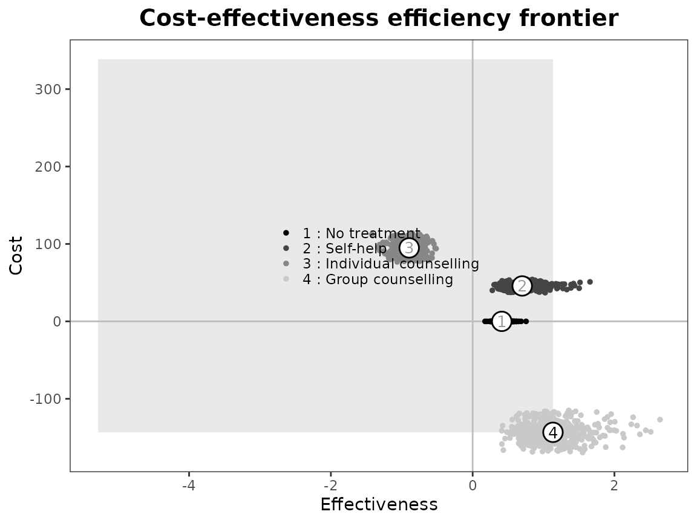

``` r
ceef.plot(bcea_smoke, graph = "base")
#> Costs and benefits are negative, the frontier will not start from the origins
#> 
#> Cost-effectiveness efficiency frontier summary 
#> 
#> Interventions on the efficiency frontier:
#>                   Effectiveness  Costs Increase slope Increase angle
#> Group counselling         1.133 -143.3             NA             NA
#> 
#> Interventions not on the efficiency frontier:
#>                        Effectiveness  Costs     Dominance type
#> No treatment                 0.41051  0.000 Absolute dominance
#> Self-help                    0.69875 45.733 Absolute dominance
#> Individual counselling      -0.89536 94.919 Absolute dominance
```


``` r


data("Smoking")
eff[, 3] <- -eff[, 3]
bcea_smoke <- bcea(eff, cost, ref = 3, interventions = treats, Kmax = 500)
ceef.plot(bcea_smoke, graph = "ggplot")
#> Benefits are negative, the frontier will not start from the origins
#> 
#> Cost-effectiveness efficiency frontier summary 
#> 
#> Interventions on the efficiency frontier:
#>                        Effectiveness   Costs Increase slope Increase angle
#> Individual counselling      -0.89536  94.919             NA             NA
#> Group counselling            1.13303 143.301         23.852         1.5289
#> 
#> Interventions not on the efficiency frontier:
#>              Effectiveness  Costs     Dominance type
#> No treatment       0.41051  0.000 Absolute dominance
#> Self-help          0.69875 45.733 Absolute dominance
```


``` r
ceef.plot(bcea_smoke, graph = "base")
#> Benefits are negative, the frontier will not start from the origins
#> 
#> Cost-effectiveness efficiency frontier summary 
#> 
#> Interventions on the efficiency frontier:
#>                        Effectiveness   Costs Increase slope Increase angle
#> Individual counselling      -0.89536  94.919             NA             NA
#> Group counselling            1.13303 143.301         23.852         1.5289
#> 
#> Interventions not on the efficiency frontier:
#>              Effectiveness  Costs     Dominance type
#> No treatment       0.41051  0.000 Absolute dominance
#> Self-help          0.69875 45.733 Absolute dominance
```


