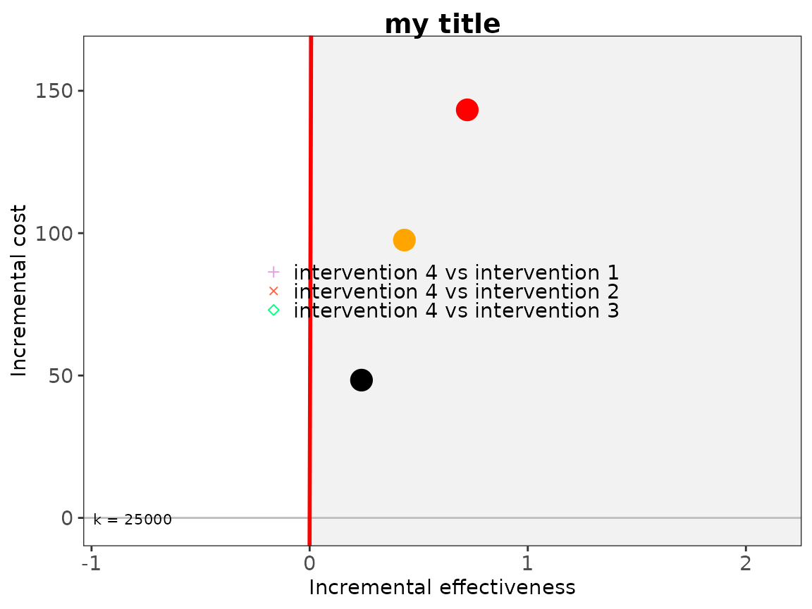
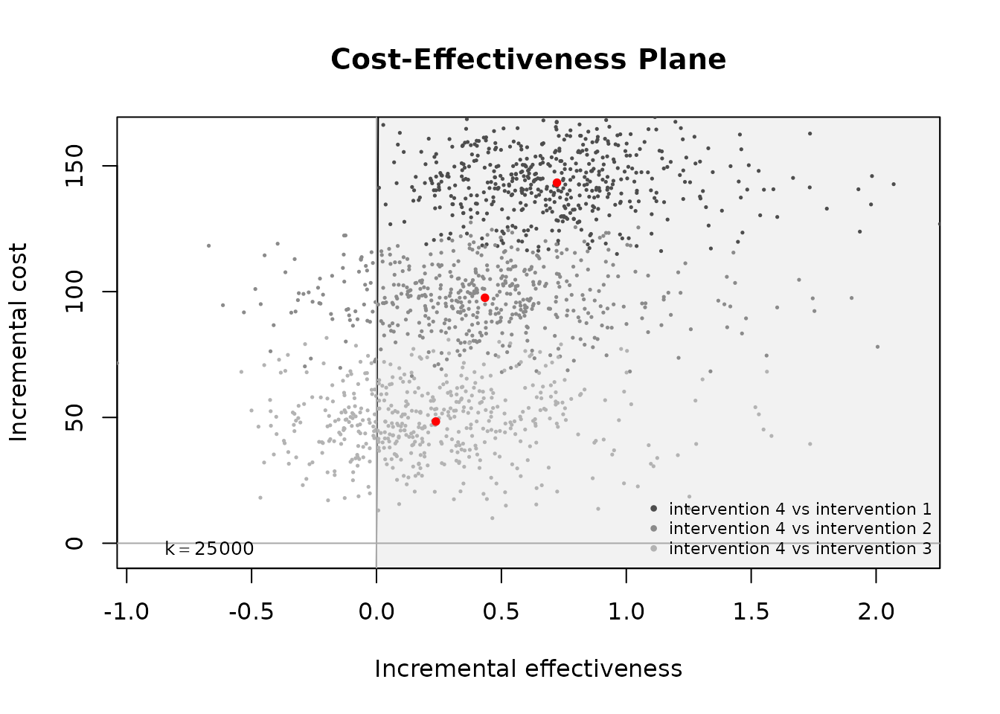
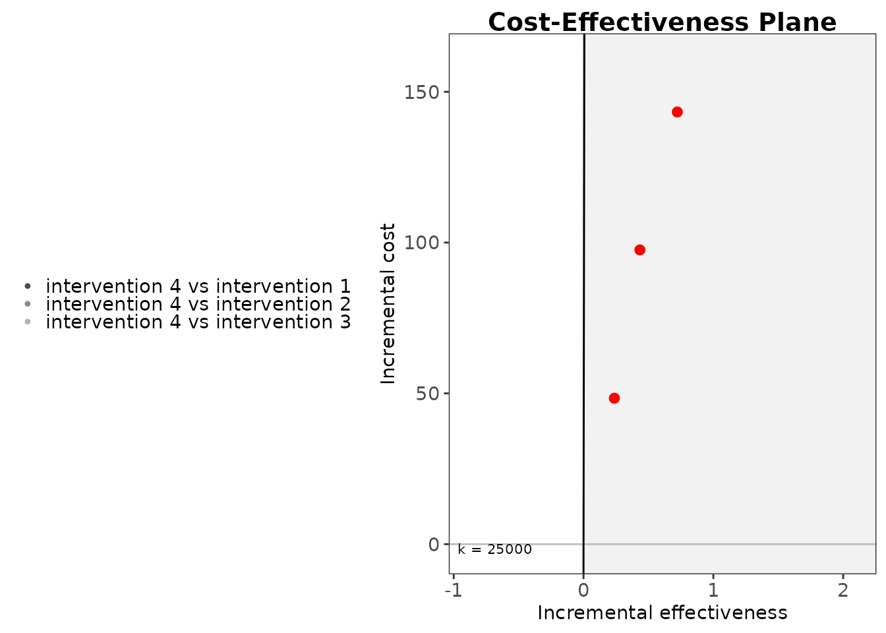
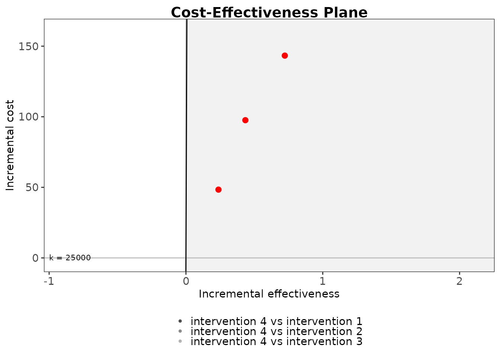
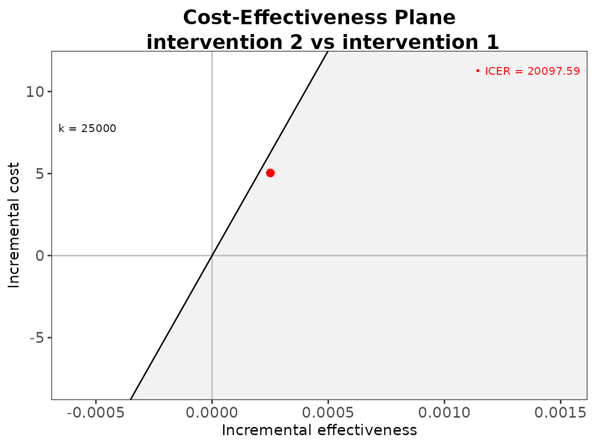
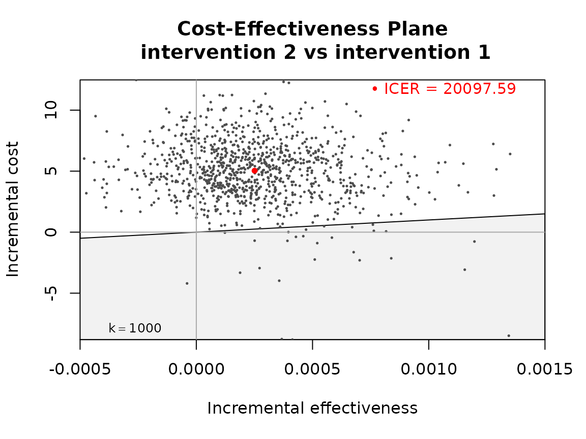

# Cost-effectiveness plane

## Introduction

The intention of this vignette is to show how to plot different styles
of cost-effectiveness acceptability curves using the BCEA package.

#### R code

To calculate these in BCEA we use the
[`bcea()`](https://n8thangreen.github.io/BCEA/reference/bcea.md)
function.

``` r
data("Vaccine")

he <- bcea(eff, cost)
#> No reference selected. Defaulting to first intervention.
```

The plot defaults to `ggplot2` R plotting. Type of plot can be set
explicitly using the `graph` argument. In fact, the default graphical
engine is set upon loading `BCEA` and can be modified globally using the
command `options(bcea.graph="...")`. Choices are `ggplot2`, `base` or
`plotly`. Partial matching is also available, so that `gg`, `g`, `pl` or
`p` are recognised alteratives to `ggplot2` or `plotly`, respectively.

``` r
ceplane.plot(he, graph = "base")
```


``` r
ceplane.plot(he, graph = "ggplot2")
```


``` r
# ceac.plot(he, graph = "plotly")
```

Other plotting arguments can be specified such as title, line colours
and theme.

``` r
ceplane.plot(he,
             graph = "ggplot2",
             title = "my title",
             line = list(color = "green", linewidth = 3),
             point = list(color = "blue", shape = 10, size = 5),
             icer = list(color = "orange", size = 5),
             area = list(fill = "grey"),
             theme = theme_linedraw())
```


If you only what the mean point then you can suppress the sample points
by passing size `NA`.

``` r
ceplane.plot(he,
             graph = "ggplot2",
             point = list(size = NA),
             icer = list(size = 5))
#> Warning: Removed 1000 rows containing missing values or values outside the scale range
#> (`geom_point()`).
```


In the default `ggplo2` version, the formatting of the axes can be
easily modify using `ggplot2` facilities, like so.

``` r
ceplane.plot(he) +
  scale_y_continuous(labels=scales::dollar_format(prefix="£")) 
#> Scale for y is already present.
#> Adding another scale for y, which will replace the existing scale.
```


The $x -$ or $y -$ axes can be modified separately using
`scale_x_continuous` or `scale_y_continuous`, respectively. See
`help(dollar_format)` from the package `scales` for more information.

## Multiple interventions

This situation is when there are more than two interventions to
consider.

#### R code

``` r
data("Smoking")

he <- bcea(eff, cost, ref = 4)
# str(he)
```

Basic plots with defaults.

``` r
ceplane.plot(he)
```


``` r
ceplane.plot(he, graph="base")
```


The font size can be adjusted using the `text` argument.

``` r
ceplane.plot(he, graph = "ggplot2", text = list(size = 20))
```



``` r
ceplane.plot(he, graph = "ggplot2", text = list(size = rel(2)))  # relative scaling, double size
```


``` r

# equivalent but more flexible and direct
ceplane.plot(he, graph = "ggplot2") +
  theme(axis.text = element_text(size = 18),
        axis.title.x = element_text(size = 20),
        axis.title.y = element_text(size = 20))
```


Numerous different styling arguments can be provided.

``` r
ceplane.plot(he,
             graph = "ggplot2",
             title = "my title",
             line = list(color = "red", size = 1),
             point = list(color = c("plum", "tomato", "springgreen"), shape = 3:5, size = 2),
             icer = list(color = c("red", "orange", "black"), size = 5))
#> Warning: Using `size` aesthetic for lines was deprecated in ggplot2 3.4.0.
#> ℹ Please use `linewidth` instead.
#> ℹ The deprecated feature was likely used in the BCEA package.
#>   Please report the issue at <https://github.com/giabaio/BCEA/issues/>.
#> This warning is displayed once every 8 hours.
#> Call `lifecycle::last_lifecycle_warnings()` to see where this warning was
#> generated.
```


There are various different ways to reposition the legend.

``` r
ceplane.plot(he, pos = FALSE) # bottom right
```


``` r
ceplane.plot(he, pos = TRUE)  # bottom left
```


With numeric coordinates we can move the legend within the plot area.

``` r
ceplane.plot(he, pos = c(0, 0))
```



``` r
ceplane.plot(he, pos = c(0, 1))
```


``` r
ceplane.plot(he, pos = c(1, 0))
```


``` r
ceplane.plot(he, pos = c(1, 1))
```


``` r

ceplane.plot(he, graph = "ggplot2", pos = c(0, 0))
```


``` r
ceplane.plot(he, graph = "ggplot2", pos = c(0, 1))
```


``` r
ceplane.plot(he, graph = "ggplot2", pos = c(1, 0))
```


``` r
ceplane.plot(he, graph = "ggplot2", pos = c(1, 1))
```


Using key words for the corners of the plot area for base R.

``` r
options(bcea.graph="base")
ceplane.plot(he, pos = "bottomright")
```


``` r
ceplane.plot(he, pos = "topright")
```


``` r
ceplane.plot(he, pos = "topleft")
```



``` r
ceplane.plot(he, pos = "bottomleft")
```


and for ggplot2 this is outside of the plot area on each side.

``` r
ceplane.plot(he, graph = "ggplot2", pos = "right")
```


``` r
ceplane.plot(he, graph = "ggplot2", pos = "top")
```


``` r
ceplane.plot(he, graph = "ggplot2", pos = "left")
```



``` r
ceplane.plot(he, graph = "ggplot2", pos = "bottom")
```


We can also adjust the layout of the ggplot2 legend to a single line
(horizontal) or stacked (vertical). If using this then you also need to
give a location as follows.

``` r
ceplane.plot(he, graph = "ggplot2", pos = "verticaltop")
```


``` r
ceplane.plot(he, graph = "ggplot2", pos = "horizontalbottom")
```


``` r
ceplane.plot(he, graph = "ggplot2", pos = "verticalbottom")
```


### Willingness-to-pay label

For [ggplot2](https://ggplot2.tidyverse.org) we can modify the
willingness-to-pay label e.g. “k = 25000”.

The default is

``` r
ceplane.plot(he, graph = "ggplot2")
```


The simplest argument is to set the value of the willingness-to-pay
threshold using `wtp`.

``` r
ceplane.plot(he, graph = "ggplot2", wtp = 10000)
```


Alternatively, we can pass a list of arguments to `wtp` to modify the
appearance of the label.

``` r
ceplane.plot(he, graph = "ggplot2", wtp = list(value = 10000))
```


``` r
ceplane.plot(he, graph = "ggplot2", wtp = list(value = 10000, color = "blue"))
```


``` r
ceplane.plot(he, graph = "ggplot2", wtp = list(color = "blue"))
```


``` r
ceplane.plot(he, graph = "ggplot2", wtp = list(size = 5))
```


To hide the text assign `size = 0`.

``` r
ceplane.plot(he, graph = "ggplot2", wtp = list(size = 0))
```


The wtp label is placed at the left hand side of the plot next to the
willingness-to-pay line by default. When this would mean the label is
off the bottom of the plot it is positioned at the bottom left corner.

``` r
data("Vaccine")
he <- bcea(eff, cost, ref=2)

ceplane.plot(he, graph = "ggplot2")
```


``` r
ceplane.plot(he, graph = "ggplot2", wtp = 1000, xlim = c(-0.0005, 0.0015))
```


``` r
ceplane.plot(he, graph = "ggplot2", wtp = 10000, xlim = c(-0.0005, 0.0015))
```


``` r
ceplane.plot(he, graph = "ggplot2", wtp = 25000, xlim = c(-0.0005, 0.0015))
```


``` r
ceplane.plot(he, graph = "ggplot2", wtp = 50000, xlim = c(-0.0005, 0.0015))
```


The position of the willingness to pay label can be adjusted using the
`label.pos` argument and a logical value.

``` r
ceplane.plot(he, graph = "ggplot2", wtp = 1000, xlim = c(-0.0005, 0.0015), label.pos = TRUE)
```



``` r
ceplane.plot(he, graph = "ggplot2", wtp = 1000, xlim = c(-0.0005, 0.0015), label.pos = FALSE)
```


A direct way of specifying the position of the label is to use the `wtp`
argument and set the `y` value in a list.

``` r
ceplane.plot(he, graph = "ggplot2", wtp = list(y = 8))
```


For base `R`

``` r
options(bcea.graph = "base")
ceplane.plot(he)  # default
```


``` r
ceplane.plot(he, wtp = 1000, xlim = c(-0.0005, 0.0015))
```


``` r
ceplane.plot(he, wtp = 10000, xlim = c(-0.0005, 0.0015))
```



``` r
ceplane.plot(he, wtp = 25000, xlim = c(-0.0005, 0.0015))
```


``` r
ceplane.plot(he, wtp = 50000, xlim = c(-0.0005, 0.0015))
```


``` r
ceplane.plot(he, wtp = 1000, xlim = c(-0.0005, 0.0015), label.pos = TRUE)
```


``` r
ceplane.plot(he, wtp = 1000, xlim = c(-0.0005, 0.0015), label.pos = FALSE)
```


``` r
##TODO: not yet implemented ggplot syntax for base R

# ceplane.plot(he, wtp = list(color = "blue"))
# ceplane.plot(he, wtp = list(y = 8))
# ceplane.plot(he, wtp = list(size = 5))
# 
# # to hide text
# ceplane.plot(he, wtp = list(size = 0))
```
