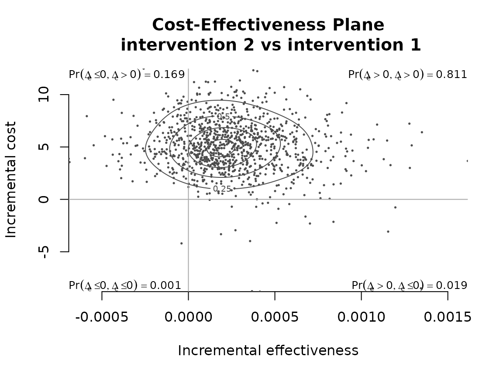
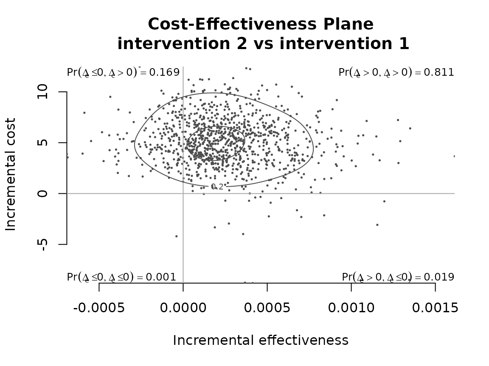
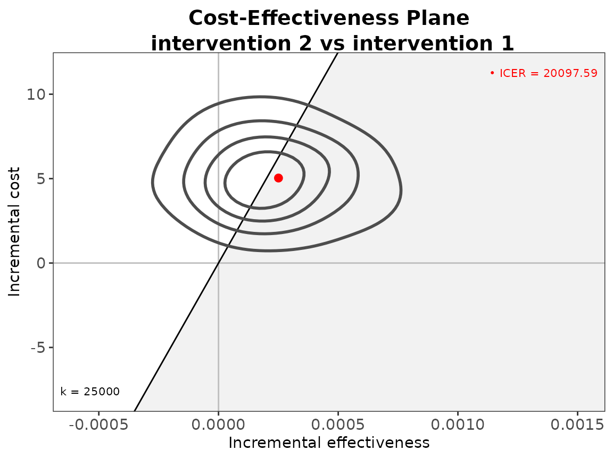
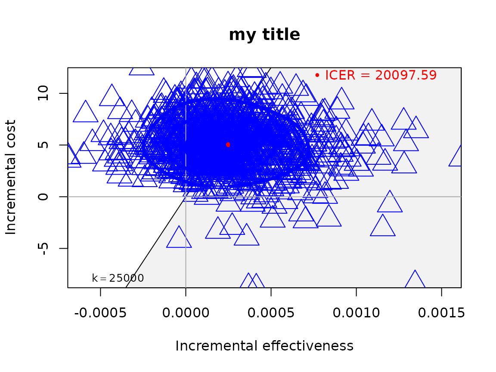
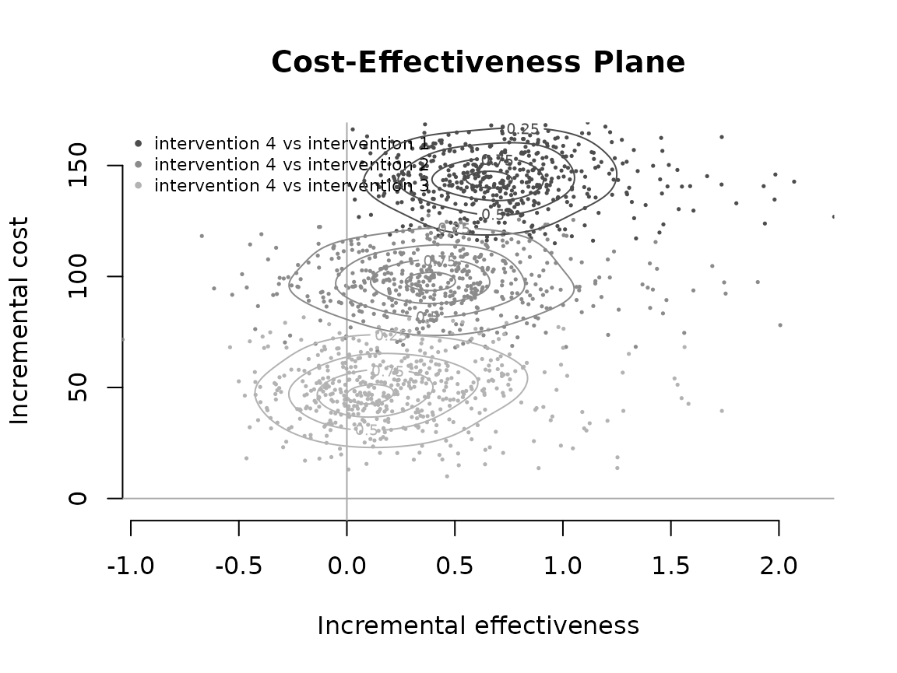
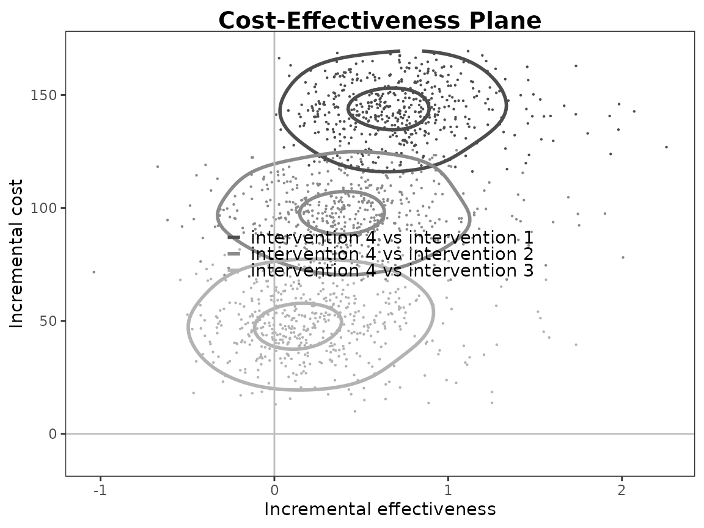
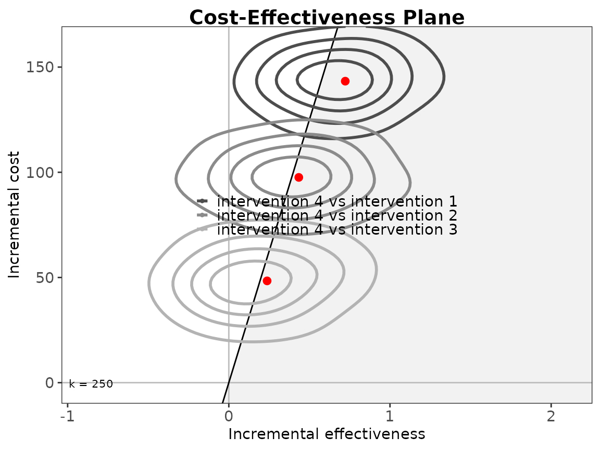
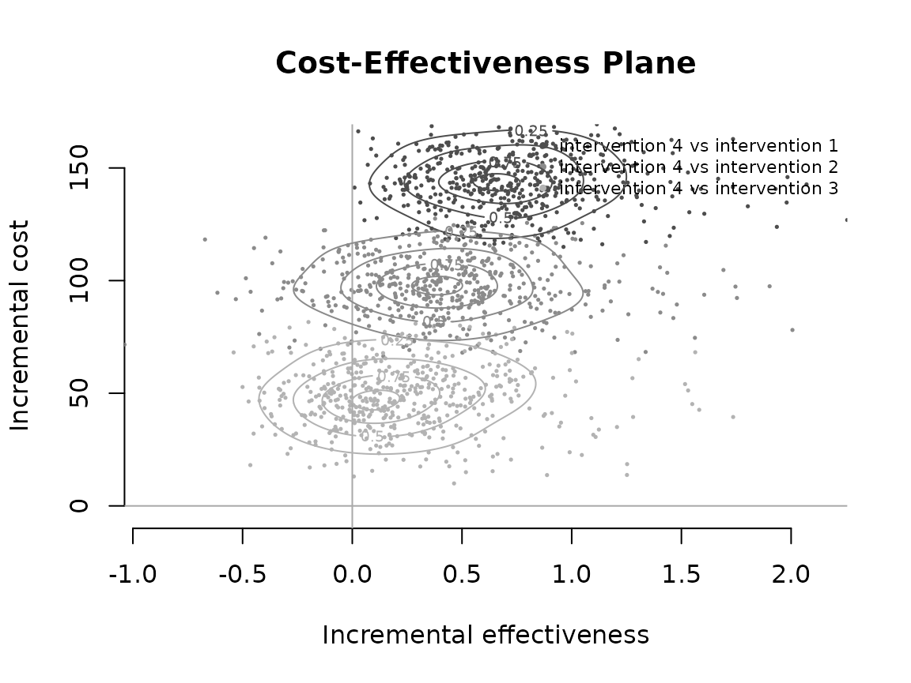

# Contour Plots

## Introduction

The intention of this vignette is to show how to plot different styles
of contour plot using the BCEA package and the
[`contour()`](https://n8thangreen.github.io/BCEA/reference/contour.md)
and
[`contour2()`](https://n8thangreen.github.io/BCEA/reference/contour2.md)
functions.

#### R code

To calculate these in BCEA we use the
[`bcea()`](https://n8thangreen.github.io/BCEA/reference/bcea.md)
function.

``` r
data("Vaccine")
he <- bcea(eff, cost, ref = 2)
```

The plot defaults to base R plotting. Type of plot can be set explicitly
using the `graph` argument.

``` r
contour(he, graph = "base")
```



``` r
contour(he, graph = "ggplot2")
```


``` r
# ceac.plot(he, graph = "plotly")
```

User-defined contour levels can be provided. The `levels` and `nlevels`
arguments specify the quantiles or number of levels. The base R levels
arguments are kept for back-compatibility and the `ggplot2` style
arguments are used in the associated plot.

``` r
contour(he, levels = c(0.2, 0.8))
```



``` r
contour(he, graph = "ggplot2", contour = list(breaks = c(0.2, 0.8)))
```


Other plotting arguments can be specified such as title, line colour and
thickness and type of point.

``` r
contour(he,
        graph = "ggplot2",
        title = "my title",
        point = list(color = "blue", shape = 2, size = 5),
        contour = list(size = 2))
#> Warning: Using `size` aesthetic for lines was deprecated in ggplot2 3.4.0.
#> ℹ Please use `linewidth` instead.
#> ℹ The deprecated feature was likely used in the BCEA package.
#>   Please report the issue at <https://github.com/giabaio/BCEA/issues/>.
#> This warning is displayed once every 8 hours.
#> Call `lifecycle::last_lifecycle_warnings()` to see where this warning was
#> generated.
```


``` r
contour(he,
        graph = "base",
        title = "my title",
        point = list(color = "blue", shape = 2, size = 2),
        contour = list(size = 2))
```


Alternatively, the
[`contour2()`](https://n8thangreen.github.io/BCEA/reference/contour2.md)
function is essentially a wrapper for
[`ceplane.plot()`](https://n8thangreen.github.io/BCEA/reference/ceplane.plot.md)
with the addition of contour lines.

``` r
contour2(he, graph = "base")
```


``` r
contour2(he, graph = "ggplot2")
```



``` r
# ceac.plot(he, graph = "plotly")
```

Other plotting arguments can be specified in exactly the same way as
above.

``` r
contour2(he,
         graph = "ggplot2",
         title = "my title",
         point = list(color = "blue", shape = 10, size = 5),
         contour = list(size = 2))
```


``` r
contour2(he,
         graph = "base",
         title = "my title",
         point = list(color = "blue", shape = 2, size = 3),
         contour = list(size = 4))
```



## Multiple interventions

This situation is when there are more than two interventions to
consider.

#### R code

``` r
data("Smoking")
he <- bcea(eff, cost, ref = 4)
# str(he)
```

Because there are multiple groups then the quadrant annotation is
omitted.

``` r
contour(he)
```



``` r
contour(he, graph = "ggplot2")
```


The `scale` argument determines the smoothness of the contours.

``` r
contour(he, scale = 0.9)
```


``` r
contour(he, graph = "ggplot2", scale = 0.9)  ##TODO: what is the equivalent ggplot2 argument?
```


The quantiles or number of levels.

``` r
contour(he, nlevels = 10)
```


``` r
contour(he, graph = "ggplot2", contour = list(bins = 10))
```


``` r
contour(he, levels = c(0.2, 0.8))
```


``` r
contour(he, graph = "ggplot2", contour = list(breaks = c(0.2, 0.8)))
```



``` r
contour(he,
        graph = "ggplot2",
        title = "my title",
        line = list(color = "red", size = 1),
        point = list(color = c("plum", "tomato", "springgreen"), shape = 3:5, size = 2),
        icer = list(color = c("red", "orange", "black"), size = 5),
        contour = list(size = 2))
```


``` r
contour(he,
        graph = "base",
        title = "my title",
        line = list(color = "red", size = 1),
        point = list(color = c("plum", "tomato", "springgreen"), shape = 3:5, size = 2),
        icer = list(color = c("red", "orange", "black"), size = 5),
        contour = list(size = 4))
```


Again, this applies to the
[`contour2()`](https://n8thangreen.github.io/BCEA/reference/contour2.md)
version of contour plot too.

``` r
contour2(he, wtp = 250)
```


``` r
contour2(he, wtp = 250, graph = "ggplot2")
```



The styling of the plot for multiple comparisons can specifically change
the colour and point type for each comparison.

``` r
contour2(he, wtp = 250,
         graph = "ggplot2",
         title = "my title",
         line = list(color = "red", size = 1),
         point = list(color = c("plum", "tomato", "springgreen"), shape = 3:5, size = 2),
         icer = list(color = c("red", "orange", "black"), size = 5),
         contour = list(size = 2))
```


``` r
contour2(he, wtp = 250,
         graph = "base",
         title = "my title",
         line = list(color = "red", size = 1),
         point = list(color = c("plum", "tomato", "springgreen"), shape = 3:5, size = 2),
         icer = list(color = c("red", "orange", "black"), size = 5),
         contour = list(size = 4))
```


Reposition legend.

``` r
contour(he, pos = FALSE)    # bottom right
```


``` r
contour(he, pos = c(0, 0))
```


``` r
contour(he, pos = c(0, 1))
```


``` r
contour(he, pos = c(1, 0))
```


``` r
contour(he, pos = c(1, 1))
```


