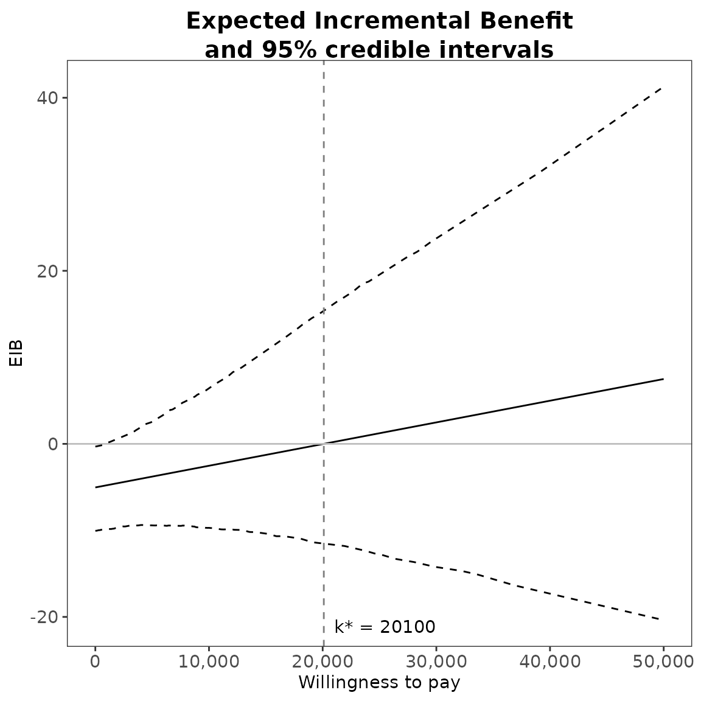
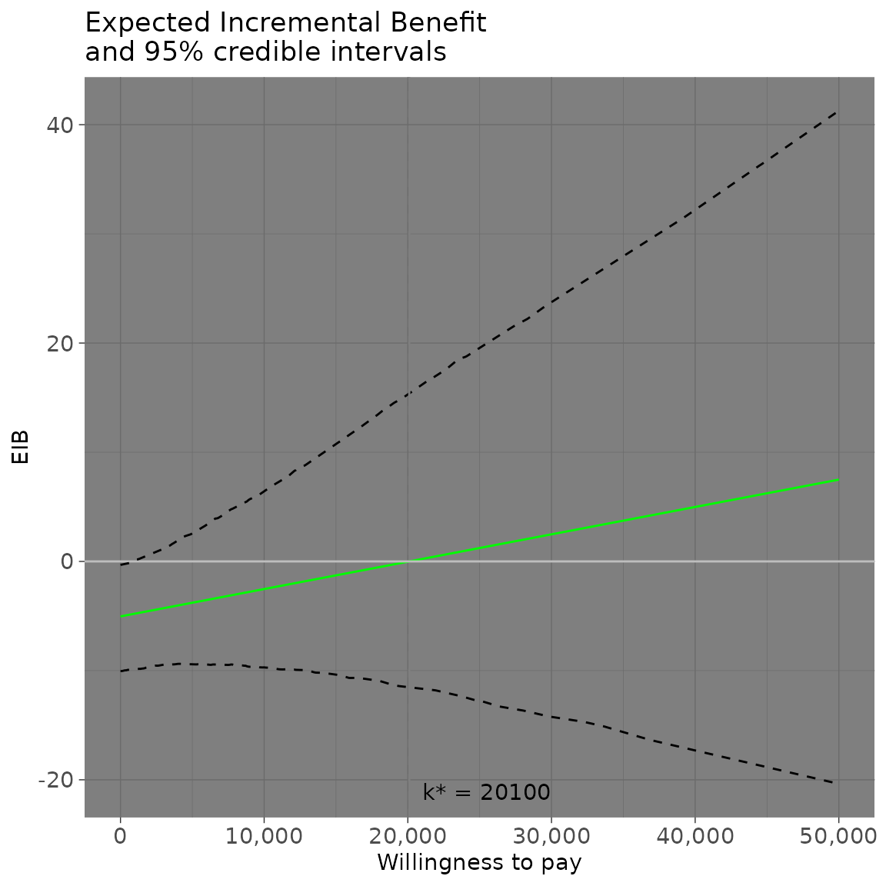
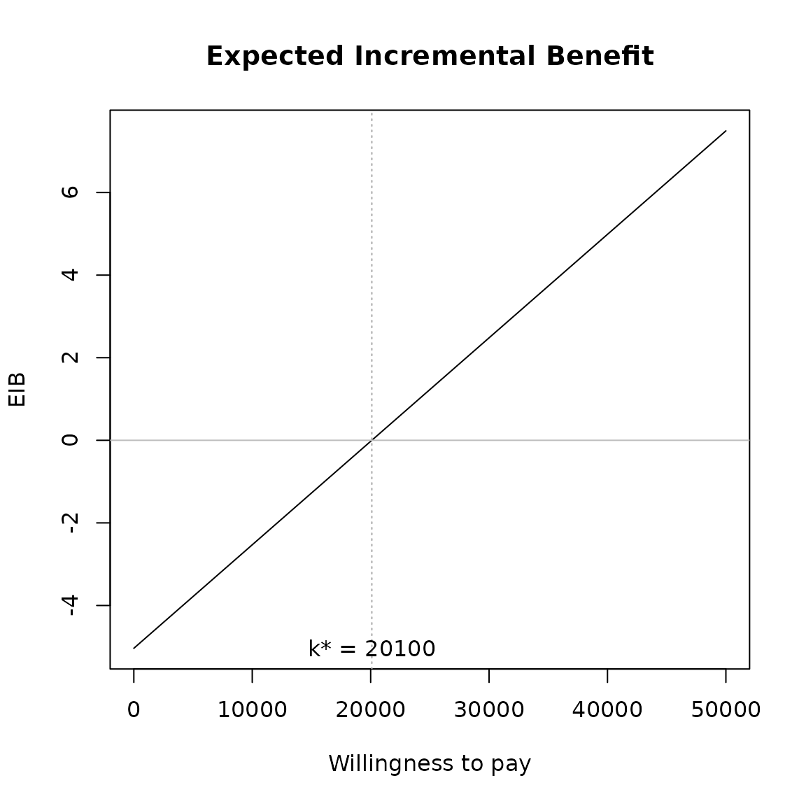
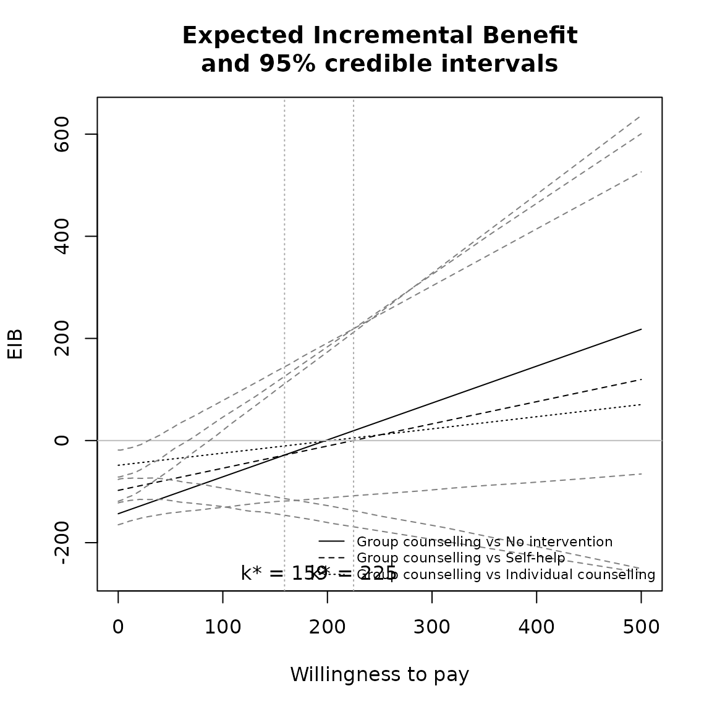
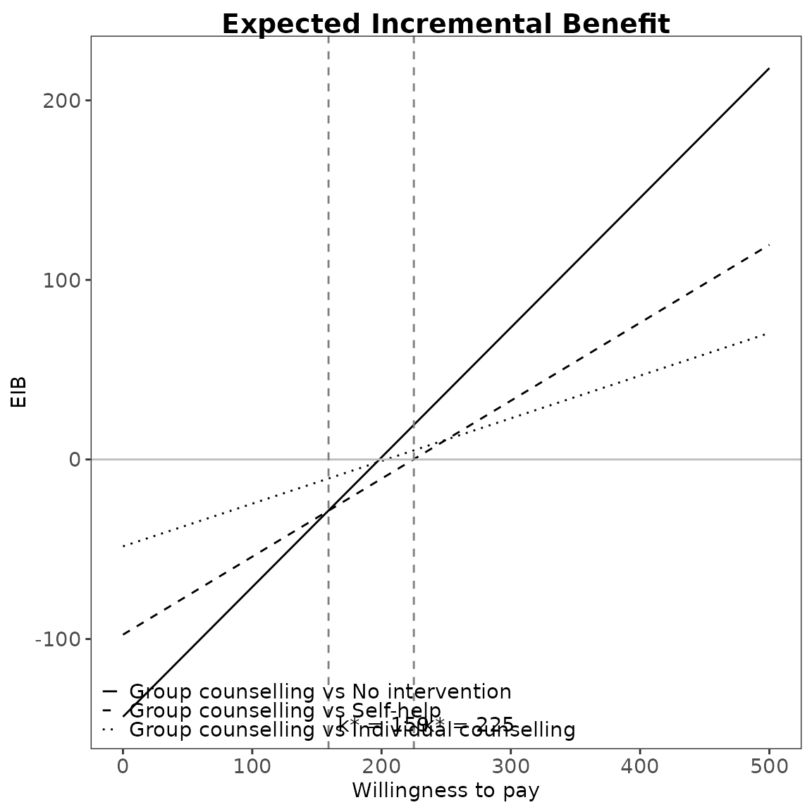
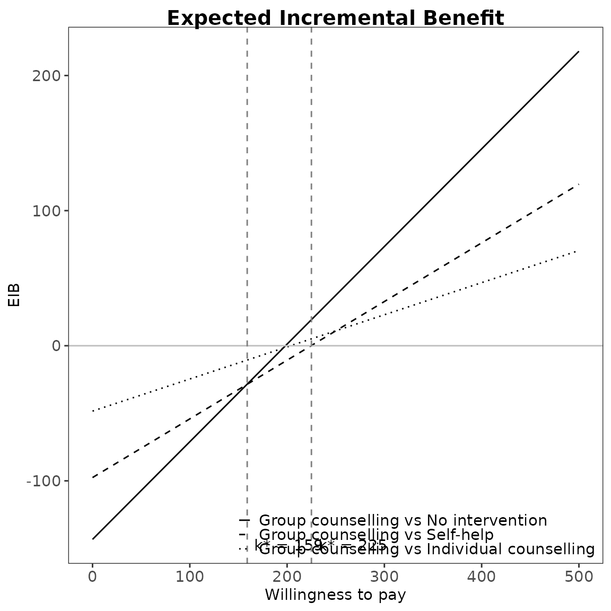
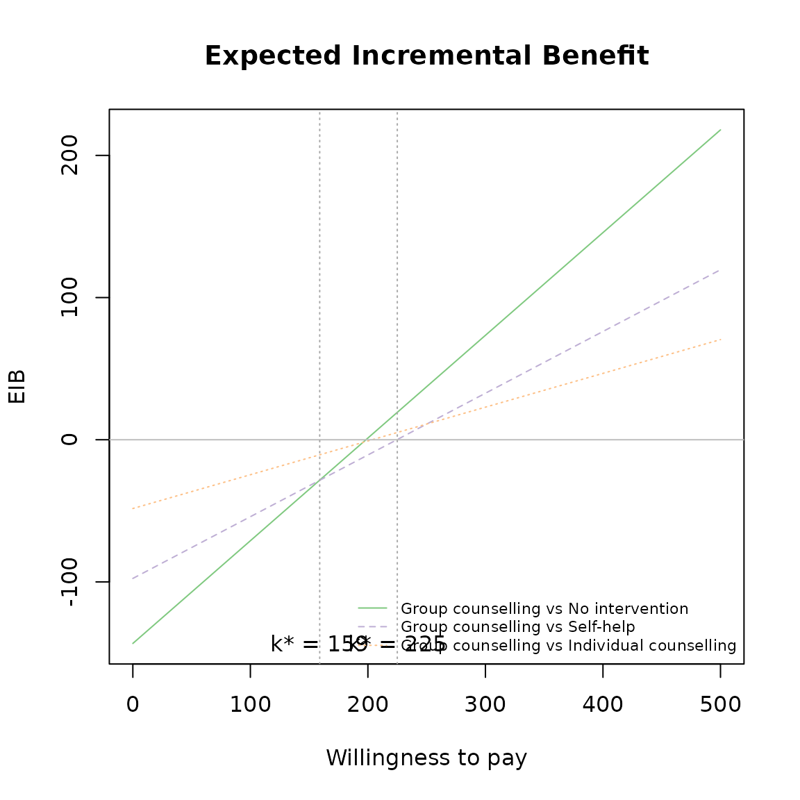
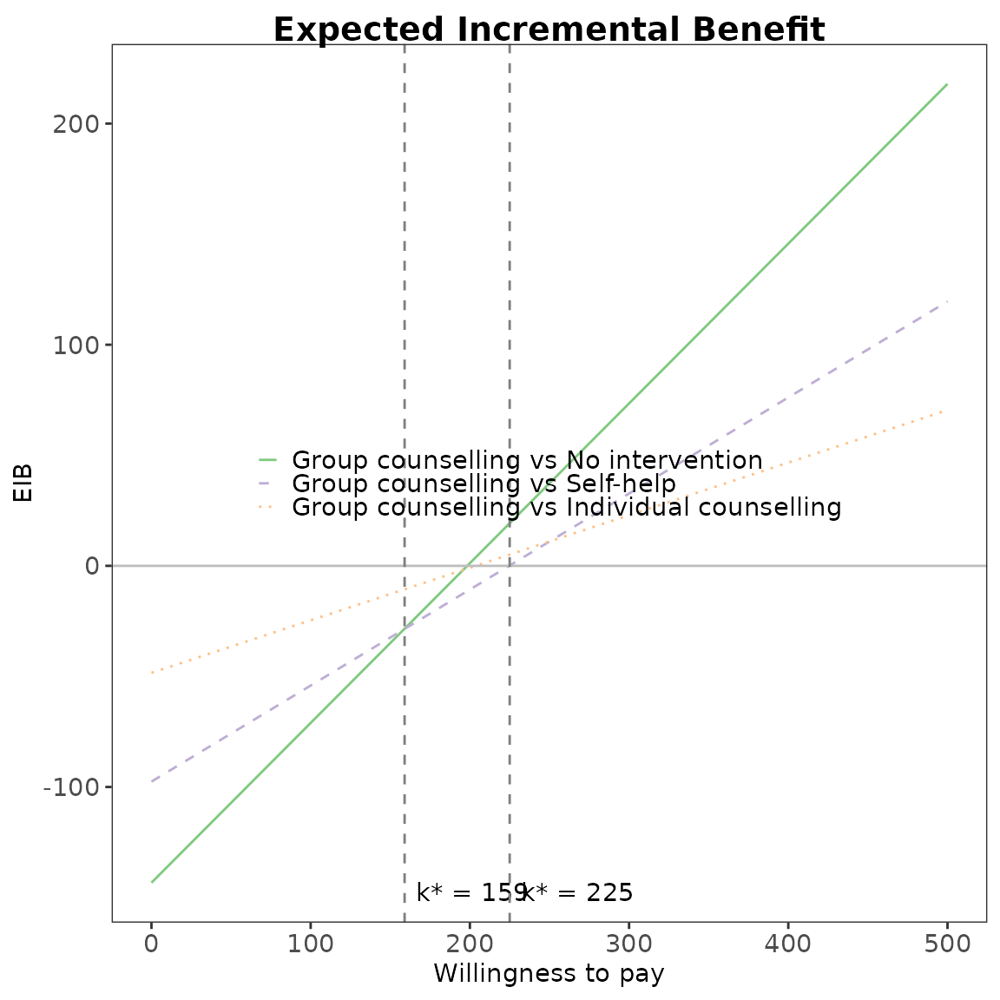

# Expected Incremental Benefit Plot

## Introduction

The intention of this vignette is to show how to plot different styles
of expected incremental benefit (EIB) plots using the BCEA package.

## Two interventions only

This is the simplest case, usually an alternative intervention ($i = 1$)
versus status-quo ($i = 0$).

The plot is based on the incremental benefit as a function of the
willingness to pay $k$.

$$IB(\theta) = k\Delta_{e} - \Delta_{c}$$

Using the set of $S$ posterior samples, the EIB is approximated by

$$\frac{1}{S}\sum\limits_{s}^{S}IB\left( \theta_{s} \right)$$

where $\theta_{s}$ is the realised configuration of the parameters
$\theta$ in correspondence of the $s$-th simulation.

#### R code

To calculate these in BCEA we use the
[`bcea()`](https://n8thangreen.github.io/BCEA/reference/bcea.md)
function.

``` r
data(Vaccine)

he <-
  bcea(eff, cost,                  
       ref = 2,                
       interventions = treats, 
       Kmax = 50000,
       plot = FALSE)
```

The plot defaults to `ggplot2` R plotting. Type of plot can be set
explicitly using the `graph` argument. In fact, the default graphical
engine is set upon loading `BCEA` and can be modified globally using the
command `options(bcea.graph="...")`. Choices are `ggplot2`, `base` or
`plotly`. Partial matching is also available, so that `gg`, `g`, `pl` or
`p` are recognised alteratives to `ggplot2` or `plotly`, respectively.

``` r
eib.plot(he)
```


The vertical line represents the break-even value corresponding to
$k^{*}$ indicating that above that threshold the alternative treatment
is more cost-effective than the status-quo.

$$k^{*} = \min\{ k:\text{EIB} > 0\}$$

This will be at the point the curve crosses the *x*-axis.

``` r
eib.plot(he, graph = "base")
```


``` r
eib.plot(he, graph = "ggplot2")
```



``` r
# ceac.plot(he, graph = "plotly")
```

Other plotting arguments can be specified such as title, line colours
and theme.

``` r
eib.plot(he,
         graph = "ggplot2",
         main = "my title",
         line = list(color = "green"),
         theme = theme_dark())
```



Credible interval can also be plotted using the `plot.cri` logical
argument.

``` r
eib.plot(he, plot.cri = FALSE)
```



In the `ggplot2` implementation, it is possible to modify the formatting
of the numerical labels in the $x -$ and $y -$ axis using `ggplot2`
failities, such as in the following code.

``` r
# Resets the formatting on the x-axis to simple numbers 
eib.plot(he) + scale_x_continuous()
#> Scale for x is already present.
#> Adding another scale for x, which will replace the existing scale.
```


``` r

# Uses currency style with £ symbol
eib.plot(he) + scale_y_continuous(labels=scales::dollar_format(prefix="£"))
```


## Multiple interventions

This situation is when there are more than two interventions to
consider. Incremental values can be obtained either always against a
fixed reference intervention, such as status quo, or for all comparisons
simultaneously.

The curves are for pair-wise comparisons against a status-quo and the
vertical lines and k\* annotation is for simultaneous comparisons.

Without loss of generality, if we assume status quo intervention
$i = 0$, then we wish to calculate

$$\frac{1}{S}\sum\limits_{s}^{S}IB\left( \theta_{s}^{i0} \right)\;\;\text{for each}\; i$$

The break-even points represent no preference between the two best
interventions at $k$.

$$k_{i}^{*} = \min\{ k:\text{EIB}\left( \theta^{i} \right) > \text{EIB}\left( \theta^{j} \right)\}$$

Only the right-most of these will be where the curves cross the x-axis.

#### R code

This is the default plot for
[`eib.plot()`](https://n8thangreen.github.io/BCEA/reference/eib.plot.md)
so we simply follow the same steps as above with the new data set.

``` r
data(Smoking)

treats <- c("No intervention", "Self-help",
            "Individual counselling", "Group counselling")
he <- bcea(eff, cost, ref = 4, interventions = treats, Kmax = 500)

eib.plot(he)
```


For example, we can change the main title and the EIB line colours to
green.

``` r
eib.plot(he,
         graph = "base",
         main = "my title",
         line = list(color = "green"))
```


``` r
eib.plot(he,
         graph = "ggplot2",
         main = "my title",
         line = list(color = "green"))
```



Credible interval can also be plotted as before. This isn’t recommended
in this case since its hard to understand with so many lines.

``` r
eib.plot(he, plot.cri = TRUE)
```


##### Repositioning the legend.

For base R,

``` r
eib.plot(he, pos = FALSE, graph = "base") # bottom right
```



``` r
eib.plot(he, pos = c(0, 0), graph = "base")
```


``` r
eib.plot(he, pos = c(0, 1), graph = "base")
```



``` r
eib.plot(he, pos = c(1, 0), graph = "base")
```


``` r
eib.plot(he, pos = c(1, 1), graph = "base")
```


For `ggplot2`,

``` r
##TODO:
eib.plot(he, graph = "ggplot2", pos = c(0, 0))
```



``` r
eib.plot(he, graph = "ggplot2", pos = c(0, 1))
```



``` r
eib.plot(he, graph = "ggplot2", pos = c(1, 0))
```


``` r
eib.plot(he, graph = "ggplot2", pos = c(1, 1))
```


Define colour palette for different colour for each EIB line.

``` r
mypalette <- RColorBrewer::brewer.pal(3, "Accent")

eib.plot(he,
         graph = "base",
         line = list(color = mypalette))
```


``` r

eib.plot(he,
         graph = "ggplot2",
         line = list(color = mypalette))
```


