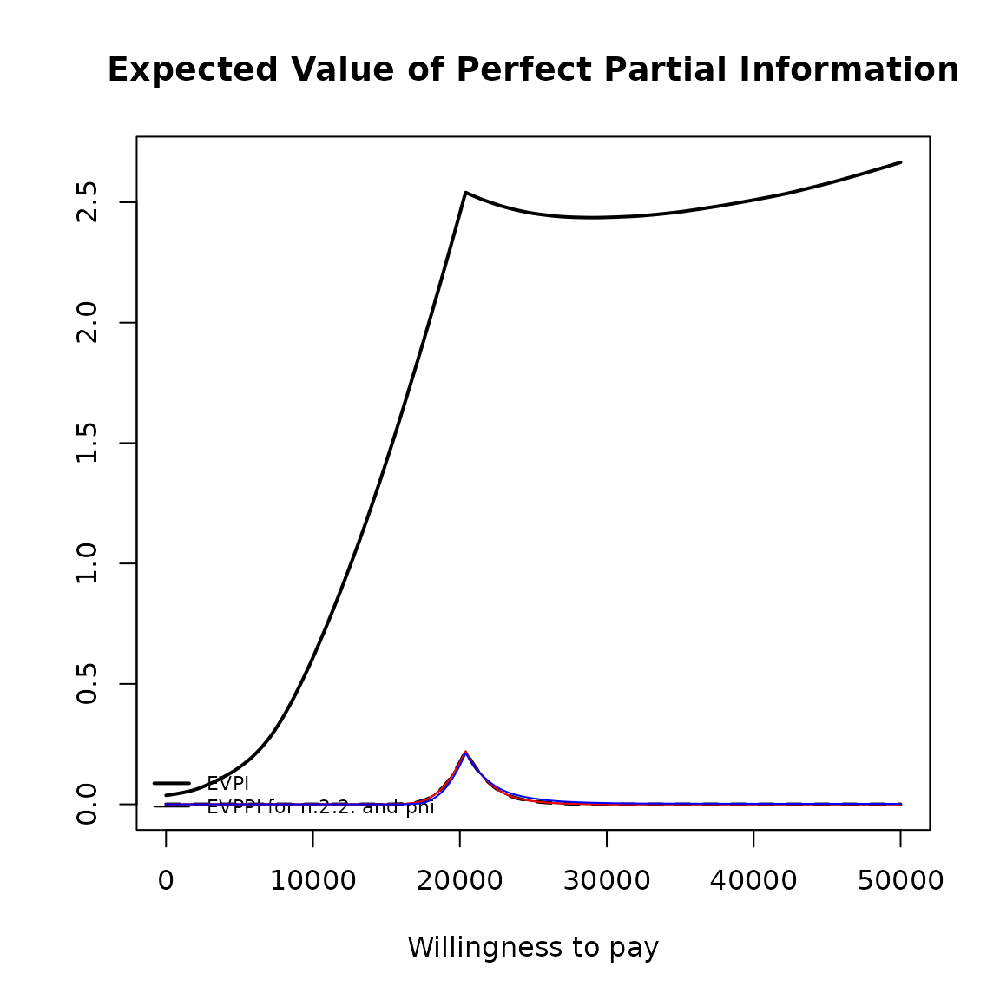
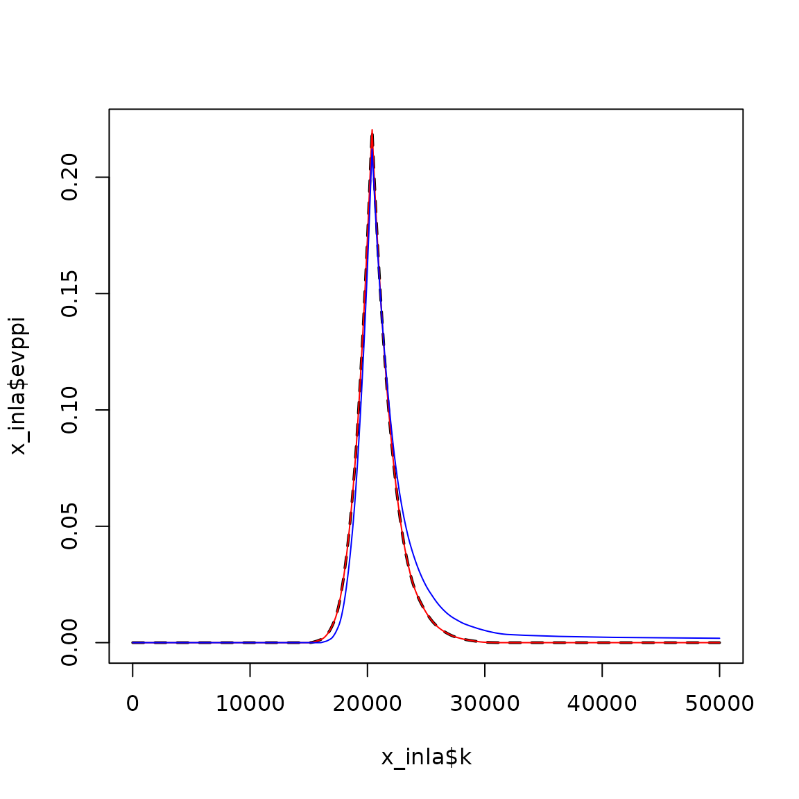

# EVPPI plots

## Introduction

## R code

``` r
data(Vaccine, package = "BCEA")
treats <- c("Status quo", "Vaccination")

# Run the health economic evaluation using BCEA
m <- bcea(e.pts, c.pts, ref = 2, interventions = treats)

# Compute the EVPPI for a bunch of parameters
inp <- createInputs(vaccine_mat)

# explicitly use BCEA package namespace to avoid voi package conflict
EVPPI <- BCEA::evppi(m, c("beta.1." , "beta.2."), inp$mat)
```

``` r
plot(EVPPI)
```


``` r
# deprecated (single parameter) methods
EVPPI.so <- BCEA::evppi(m, c("beta.1.", "beta.2."), inp$mat, method = "so", n.blocks = 50)
EVPPI.sad <- BCEA::evppi(m, c("beta.1.", "beta.2."), inp$mat, method = "sad", n.seps = 1)

plot(EVPPI.so)
plot(EVPPI.sad)
```

``` r
# Compute the EVPPI using INLA/SPDE
x_inla <- BCEA::evppi(he = m, 39:40, input = inp$mat)

# using GAM regression
x_gam <- BCEA::evppi(he = m, 39:40, input = inp$mat, method = "GAM")

# using Strong et al GP regression
x_gp <- BCEA::evppi(he = m, 39:40, input = inp$mat, method = "GP")

plot(x_inla, graph = "base")
lines(x_inla$k, x_inla$evppi, lwd = 2, lty = 2)
lines(x_gam$k, x_gam$evppi, col = "red")
lines(x_gp$k, x_gp$evppi, col = "blue")
```



``` r

# zoom in
plot(x_inla$k, x_inla$evppi, type = "l", lwd = 2, lty = 2)
lines(x_gam$k, x_gam$evppi, col = "red")
lines(x_gp$k, x_gp$evppi, col = "blue")
```



``` r
data(Smoking)
treats <- c("No intervention", "Self-help",
            "Individual counselling", "Group counselling")

m <- bcea(eff, cost, ref = 4, interventions = treats, Kmax = 500)

inp <- createInputs(smoking_output)

EVPPI <- BCEA::evppi(m, c(2,3), inp$mat, h.value = 0.0000005)

plot(EVPPI)
```


