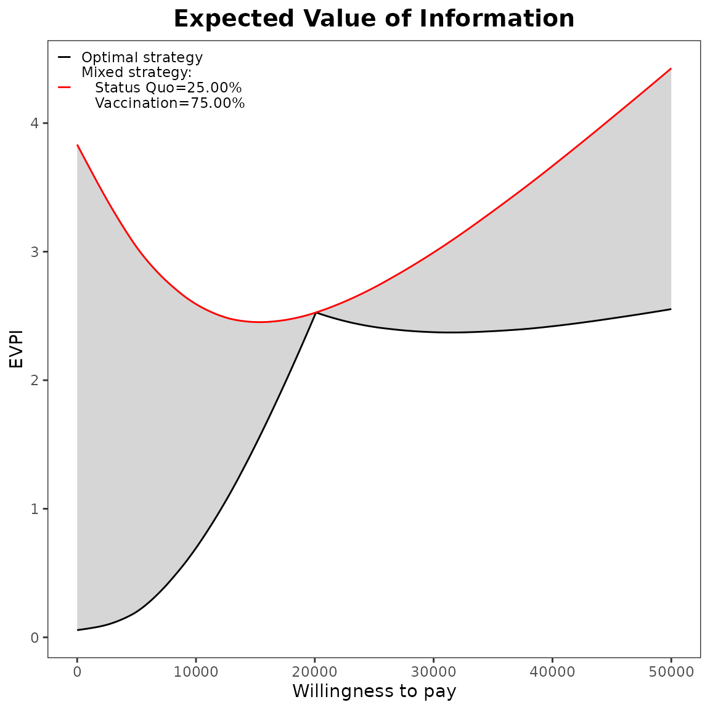
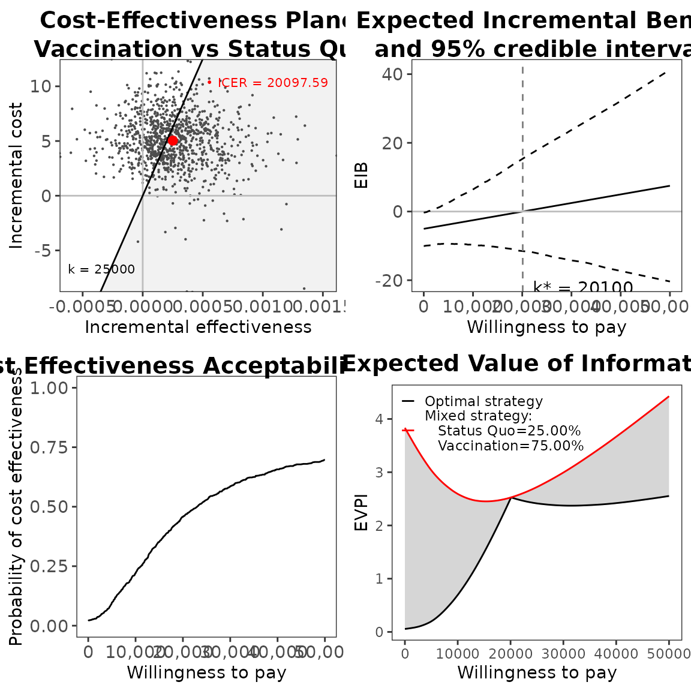
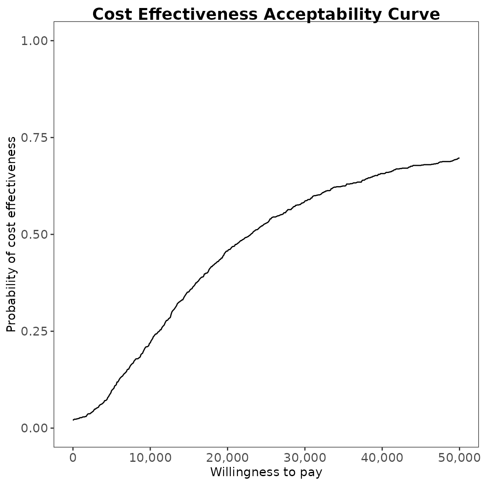
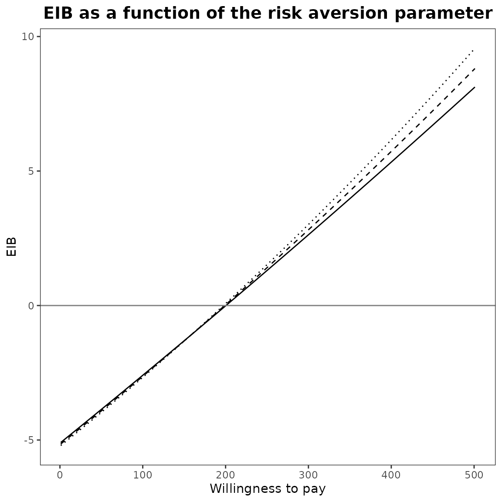
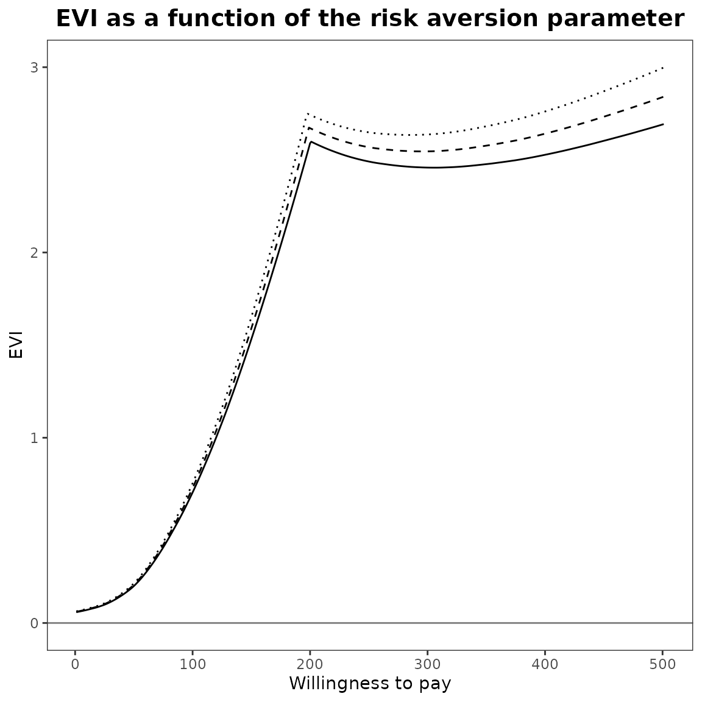
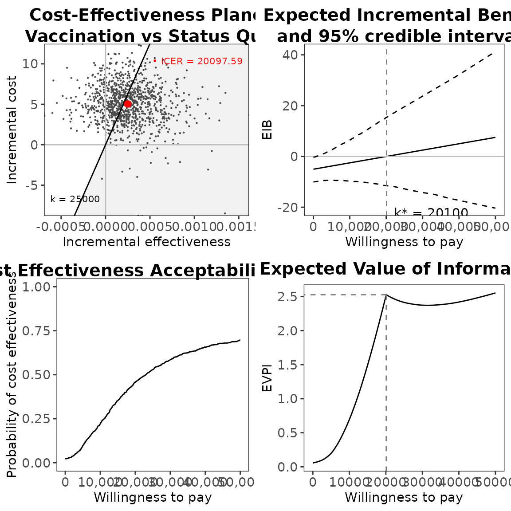

# Reset a BCEA object

## Introduction

When running `BCEA`, we create objects that belong in a special `bcea`
“class”

``` r
data(Vaccine)
m=bcea(eff,cost,ref=2,interventions=treats)
class(m)
#> [1] "bcea" "list"
```

We may want to run advanced analyses on this object. For instance, we
may consider the “mixed analysis”, which accounts for the potential
market shares of the interventions being compared

``` r
mixedAn(m)=c(.25,.75)
class(m)
#> [1] "mixedAn" "bcea"    "list"
```

— in this case, we assume that intervention $t = 1$ has 25% of the
market and intervetion $t = 2$ has the remaining 75%.

This operation changes the nature of the `m` object, to which we add
relevant quantities/variables and an additional class `mixedAn`. This
unlocks new plotting methods. For instance, when we do

``` r
plot(m)
#> Warning in plot.mixedAn(m): 'plot.mixedAn' is deprecated.
#> Use 'evi.plot' instead.
#> See help("Deprecated")
```

 we get a
specialised graph, describing the Expected Value of Information
comparing the mixed with the optimal strategy (in which we allocate all
the shares to the intervention that is most cost-effective, given
current evidence). The gray area represent the loss due to “market
inefficiency”.

Interestingly, because we do not remove the class `bcea` from the object
`m`, we can still use the original methods calling them specifically.
For instance

``` r
BCEA:::plot.bcea(m)
```

 now returns the
“standard” graphical summary of the basic economic evaluation performed
by [`bcea()`](https://n8thangreen.github.io/BCEA/reference/bcea.md).

In addition, methods for which a `mixedAn` option is not available
(e.g. `ceac.plot`) can be used directly – after all, `m` is still an
object of the class `bcea` too and so if we try

``` r
ceac.plot(m)
```

`R` will
understand to apply the method
[`ceac.plot.bcea()`](https://n8thangreen.github.io/BCEA/reference/ceac.plot.md)
in the background.

Similar reasoning applies if we use the `CEriskav` class, which we can
do by calling

``` r
CEriskav(m)=c(.001,.002,.003)
class(m)
#> [1] "CEriskav" "mixedAn"  "bcea"     "list"
```

This adds another class to the object `m` and unlocks other `plot`
methods. Now `CEriskav` becomes the default class and so

``` r
plot(m)
```


generates the specific graph to perform the analysis including risk
aversion. But

``` r
BCEA:::plot.mixedAn(m)
#> Warning in BCEA:::plot.mixedAn(m): 'BCEA:::plot.mixedAn' is deprecated.
#> Use 'evi.plot' instead.
#> See help("Deprecated")
```

 applies the
specific method to do the mixed analysis.

**IF** we want to return to the original status and remove the extra
credentials generated when calling `mixedAn` and/or `CEriskav`, we can
simply use the
[`reset_bcea()`](https://n8thangreen.github.io/BCEA/reference/reset_bcea.md)
function.

``` r
m=reset_bcea(m)
class(m)
#> [1] "bcea" "list"
plot(m)
```


