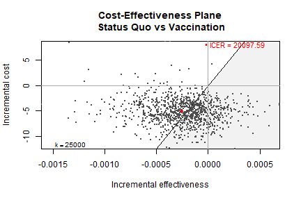
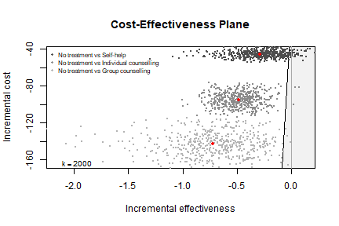
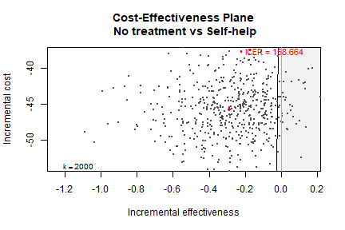
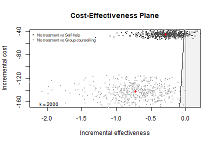

 
 


```r
library(BCEA)
```

There are several arguments passed to `bcea()` to specify the form of the analysis.
These are


```r
bcea(eff, cost,
     ref = 1,
     interventions = NULL,
     .comparison = NULL,
     Kmax = 50000,
     wtp = NULL,
     plot = FALSE)
```

Those of interest here are:

* `ref` is the reference intervention group to compare against the other groups.
* `.comparisons` are the groups to compare against `ref`. The default is all of the non-`ref` groups.
  This is a new argument in the latest release of BCEA to make it more flexible and consistent with other functions.
  A preceding dot is used to keep it back-compatible with previous versions of BCEA.
  Argument `c` is partially matched with both `c` and `comparison` otherwise throwing an error.
* `Kmax` is the maximum value of the willingness-to-pay to calculate statistics for.

During an analysis we may want to explore changing some of these parameters and keeping all of the others the same.
We can do with with package setter functions.

### Changing Reference Group

Load cost-effectiveness data.


```r
data(Vaccine)
```

We first create `bcea` object using the constructor function for 2 different reference groups.


```r
he_ref1 <- bcea(eff, cost,
                ref = 1,           
                interventions = treats,
                Kmax = 50000)  
str(he_ref1)
#> List of 24
#>  $ n_sim        : int 1000
#>  $ n_comparators: num 2
#>  $ n_comparisons: int 1
#>  $ delta_e      :'data.frame':	1000 obs. of  1 variable:
#>   ..$ Vaccination: num [1:1000] -0.000148 -0.000152 -0.000192 -0.000504 -0.000394 ...
#>  $ delta_c      :'data.frame':	1000 obs. of  1 variable:
#>   ..$ Vaccination: num [1:1000] -5.84 -3.54 -10.15 -6.45 -6.68 ...
#>  $ ICER         : Named num 20098
#>   ..- attr(*, "names")= chr "Vaccination"
#>  $ Kmax         : num 50000
#>  $ k            : num [1:501] 0 100 200 300 400 500 600 700 800 900 ...
#>  $ ceac         : num [1:501, 1] 0.98 0.978 0.977 0.977 0.977 0.976 0.976 0.975 0.975 0.973 ...
#>   ..- attr(*, "dimnames")=List of 2
#>   .. ..$ k   : NULL
#>   .. ..$ ints: chr "Vaccination"
#>  $ ib           : num [1:501, 1:1000, 1] 5.84 5.83 5.81 5.8 5.78 ...
#>   ..- attr(*, "dimnames")=List of 3
#>   .. ..$ k   : NULL
#>   .. ..$ sims: NULL
#>   .. ..$ ints: chr "Vaccination"
#>  $ eib          : num [1:501, 1] 5.04 5.01 4.99 4.96 4.94 ...
#>   ..- attr(*, "dimnames")=List of 2
#>   .. ..$ k   : NULL
#>   .. ..$ ints: chr "Vaccination"
#>  $ kstar        : num 20100
#>  $ best         : int [1:501] 1 1 1 1 1 1 1 1 1 1 ...
#>  $ U            : num [1:1000, 1:501, 1:2] -10.41 -5.83 -5.78 -12.21 -9.79 ...
#>   ..- attr(*, "dimnames")=List of 3
#>   .. ..$ sims: NULL
#>   .. ..$ k   : NULL
#>   .. ..$ ints: chr [1:2] "Status Quo" "Vaccination"
#>  $ vi           : num [1:1000, 1:501] -0.754 3.821 3.871 -2.553 -0.131 ...
#>  $ Ustar        : num [1:1000, 1:501] -10.41 -5.83 -5.78 -12.21 -9.79 ...
#>  $ ol           : num [1:1000, 1:501] 0 0 0 0 0 0 0 0 0 0 ...
#>  $ evi          : num [1:501] 0.0562 0.0573 0.0586 0.0598 0.0611 ...
#>  $ ref          : int 1
#>  $ comp         : int 2
#>  $ step         : num 100
#>  $ interventions: chr [1:2] "Status Quo" "Vaccination"
#>  $ e            : num [1:1000, 1:2] -0.001047 -0.000884 -0.00089 -0.001643 -0.001352 ...
#>   ..- attr(*, "dimnames")=List of 2
#>   .. ..$ : NULL
#>   .. ..$ : chr [1:2] "Status Quo" "Vaccination"
#>  $ c            : num [1:1000, 1:2] 10.41 5.83 5.78 12.21 9.79 ...
#>   ..- attr(*, "dimnames")=List of 2
#>   .. ..$ : NULL
#>   .. ..$ : chr [1:2] "Status Quo" "Vaccination"
#>  - attr(*, "class")= chr [1:2] "bcea" "list"

ceplane.plot(he_ref1)
```




```r
he_ref2 <- bcea(eff, cost,
                ref = 2,           
                interventions = treats,
                Kmax = 50000)  

str(he_ref2[c("n_comparators", "ICER", "ref", "comp")])
#> List of 4
#>  $ n_comparators: num 2
#>  $ ICER         : Named num 20098
#>   ..- attr(*, "names")= chr "Status Quo"
#>  $ ref          : int 2
#>  $ comp         : int 1
```

Alternatively, we can do the same by modifying the first output.


```r
setReferenceGroup(he_ref1) <- 2

str(he_ref1[c("n_comparators", "ICER", "ref", "comp")])
#> List of 4
#>  $ n_comparators: num 2
#>  $ ICER         : Named num 20098
#>   ..- attr(*, "names")= chr "Status Quo"
#>  $ ref          : int 2
#>  $ comp         : int 1
```

### Changing Kmax

In the same way as above we can change `Kmax` in 2 equivalent ways.


```r
he_Kmax1 <- bcea(eff, cost,
                 ref = 1,           
                 interventions = treats,
                 Kmax = 50000)  

str(he_Kmax1[c("n_comparators", "ICER", "ref", "comp", "Kmax")])
#> List of 5
#>  $ n_comparators: num 2
#>  $ ICER         : Named num 20098
#>   ..- attr(*, "names")= chr "Vaccination"
#>  $ ref          : int 1
#>  $ comp         : int 2
#>  $ Kmax         : num 50000
```


```r
he_Kmax2 <- bcea(eff, cost,
                 ref = 2,           
                 interventions = treats,
                 Kmax = 2000)  

str(he_Kmax2[c("n_comparators", "ICER", "ref", "comp", "Kmax")])
#> List of 5
#>  $ n_comparators: num 2
#>  $ ICER         : Named num 20098
#>   ..- attr(*, "names")= chr "Status Quo"
#>  $ ref          : int 2
#>  $ comp         : int 1
#>  $ Kmax         : num 2000
```


```r
setKmax(he_Kmax1) <- 2000

str(he_Kmax1[c("n_comparators", "ICER", "ref", "comp", "Kmax")])
#> List of 5
#>  $ n_comparators: num 2
#>  $ ICER         : Named num 20098
#>   ..- attr(*, "names")= chr "Vaccination"
#>  $ ref          : int 1
#>  $ comp         : int 2
#>  $ Kmax         : num 2000
```

### Change Comparison Groups

Lets load some data with more than two groups.


```r
data(Smoking)
```

Defaults is all other groups which in this case is 2, 3 and 4.


```r
he_comp234 <- bcea(eff, cost,
                   ref = 1,           
                   interventions = treats,
                   Kmax = 50000)  

str(he_comp234[c("n_comparators", "ICER", "ref", "comp")])
#> List of 4
#>  $ n_comparators: num 4
#>  $ ICER         : Named num [1:3] 159 196 198
#>   ..- attr(*, "names")= chr [1:3] "Self-help" "Individual counselling" "Group counselling"
#>  $ ref          : int 1
#>  $ comp         : int [1:3] 2 3 4

ceplane.plot(he_comp234, wtp = 2000)
```



Let us compare against only groups 2.


```r
he_comp2 <- bcea(eff, cost,
                 ref = 1,
                 .comparison = 2,
                 interventions = treats,
                 Kmax = 2000)  

str(he_comp2[c("n_comparators", "ICER", "ref", "comp")])
#> List of 4
#>  $ n_comparators: num 2
#>  $ ICER         : Named num 159
#>   ..- attr(*, "names")= chr "Self-help"
#>  $ ref          : int 1
#>  $ comp         : num 2

ceplane.plot(he_comp2, wtp = 2000)
```


We can achieve the same thing using the appropriate setter.


```r
setComparisons(he_comp234) <- 2

str(he_comp234[c("n_comparators", "ICER", "ref", "comp")])
#> List of 4
#>  $ n_comparators: num 2
#>  $ ICER         : Named num 159
#>   ..- attr(*, "names")= chr "Self-help"
#>  $ ref          : int 1
#>  $ comp         : num 2

ceplane.plot(he_comp234, wtp = 2000)
```


  
We can select multiple comparison groups too.
Let us compare against only groups 2 and 4.


```r
he_comp24 <- bcea(eff, cost,
                  ref = 1,
                  .comparison = c(2,4),
                  interventions = treats,
                  Kmax = 2000)  
str(he_comp24[c("n_comparators", "ICER", "ref", "comp")])
#> List of 4
#>  $ n_comparators: num 3
#>  $ ICER         : Named num [1:2] 159 198
#>   ..- attr(*, "names")= chr [1:2] "Self-help" "Group counselling"
#>  $ ref          : int 1
#>  $ comp         : num [1:2] 2 4

ceplane.plot(he_comp24, wtp = 2000)
```


```r
setComparisons(he_comp234) <- c(2,4)

str(he_comp234[c("n_comparators", "ICER", "ref", "comp")])
#> List of 4
#>  $ n_comparators: num 3
#>  $ ICER         : Named num [1:2] 159 198
#>   ..- attr(*, "names")= chr [1:2] "Self-help" "Group counselling"
#>  $ ref          : int 1
#>  $ comp         : num [1:2] 2 4

ceplane.plot(he_comp24, wtp = 2000)
```


Further, a `bcea` object with all comparison groups can be passed to other functions such as `ceplane.plot` and `ceac.plot` with a `comparison` argument,
which will do the modifications using these functions internally instead.


```r
ceplane.plot(he_comp234, comparison = 2, wtp = 2000)
```



```r
ceplane.plot(he_comp234, comparison = c(2,4), wtp = 2000)
```




